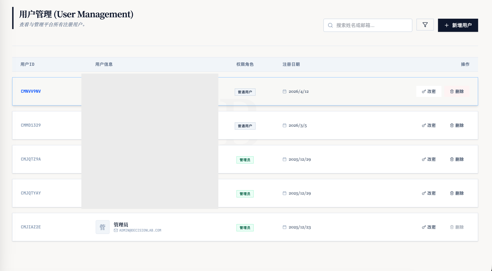

# 用户管理

## 1. 文档用途

本说明用于帮助您了解平台中的“用户管理”页面，学会查看现有用户、搜索用户、创建新用户，以及理解常用管理按钮的作用。  
如果您负责平台日常维护，建议先阅读本页，再继续使用“系统设置”等系统级功能。

## 2. 您将在本页完成什么

阅读完本页后，您可以完成以下事情：

1. 进入用户管理页面。
2. 查看当前系统中的用户列表。
3. 使用搜索框快速查找用户。
4. 打开“新增用户”窗口并填写基础信息。
5. 了解“改密”“删除”等常用管理入口的含义。

## 3. 分步操作

### 第一步：进入“用户管理”

在系统左侧导航栏中，找到“系统”分组，点击“用户管理”。

操作后，您会看到用户列表页。页面会展示系统中已注册的用户，以及每位用户的基本信息、角色、注册日期和可执行操作。

您可以先浏览整张列表，建立对当前账号情况的整体认识。

### 第二步：查看和搜索用户

进入页面后，您可以先查看列表中的几项核心信息：

1. `用户ID`：系统自动生成的账号标识。
2. `用户信息`：包括姓名和邮箱。
3. `权限角色`：用于区分普通使用者与系统管理员。
4. `注册日期`：便于判断账号建立时间。
5. `操作`：用于执行改密、删除等管理动作。

如果您想快速查找某个人，可以在页面上方的搜索框中输入姓名或邮箱关键词。

操作后，页面会根据您输入的内容筛选列表，方便您更快定位目标账号。

### 第三步：点击“新增用户”

如果您需要为新同事开通账号，请点击页面右上方的“新增用户”按钮。

操作后，系统会打开新增用户填写窗口，要求您填写姓名、邮箱、密码和角色。

建议您按下面的方式填写：

1. `姓名`：填写真实姓名，便于后续识别。
2. `邮箱`：填写对方常用邮箱，后续登录和识别都会用到。
3. `密码`：设置初始密码，建议由管理员统一规范。
4. `角色`：按实际职责选择“普通用户”或“管理员”。

填写完成后，点击“创建用户”即可提交。

操作后，如果创建成功，系统通常会关闭填写窗口，并在列表中出现新的用户记录。

### 第四步：角色选择

在新增用户时，角色选择非常重要：

1. `普通用户`：适合参与研究、查看自己相关内容的日常使用者。
2. `管理员`：适合负责系统维护、用户维护和全局设置的人员。

如果您不确定应给哪种角色，建议先使用“普通用户”。  
只有在确实需要管理系统时，再授予管理员权限。

### 第五步：使用“改密”和“删除”

在每位用户对应的操作区，您通常会看到“改密”和“删除”按钮。

它们分别表示：

1. `改密`：为该账号重新设置密码，适合账号交接、密码遗忘或统一重置时使用。
2. `删除`：移除该账号，适合停用不再使用的人员账号。

操作后，系统会按当前动作进入对应流程。  
如果某个账号的“删除”按钮不可用，通常表示该账号属于当前正在登录的管理账号，系统不会允许您直接删除自己，以避免影响系统管理。
