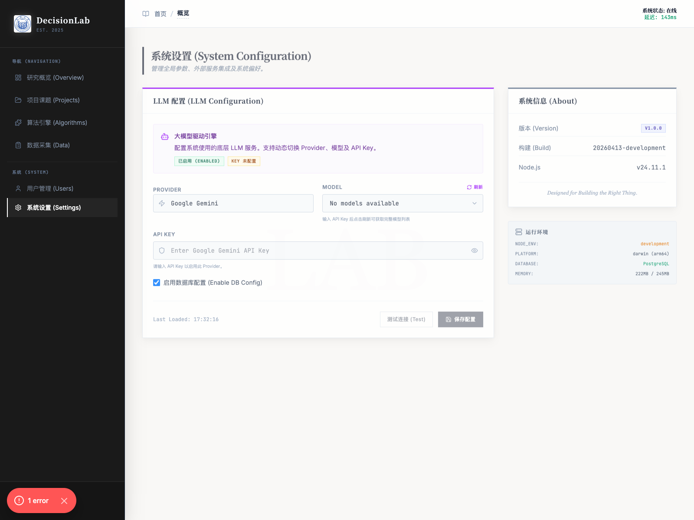

# 系统设置

## 1. 文档用途

本说明用于帮助您认识平台中的“系统设置”页面，了解大模型服务配置、连接状态查看、保存入口以及页面下方系统信息的用途。  
本页更适合负责平台维护或初始化配置的管理人员阅读。

## 2. 您将在本页完成什么

阅读完本页后，您可以完成以下事情：

1. 进入系统设置页面。
2. 了解大模型配置区各项内容的用途。
3. 理解何时需要填写 Key、刷新模型、测试连接和保存配置。
4. 查看当前系统版本、构建信息和运行环境概况。
5. 知道哪些设置可以调整，哪些内容建议保持默认。

## 3. 操作前准备

开始前，请先确认以下事项：

1. 您已经登录系统，并具备管理员权限。
2. 您知道本次准备接入哪一种大模型服务。
3. 如果您要完成正式配置，建议提前准备好对应的 Key 信息。

如果您当前只是查看页面结构和状态，也可以先不填写任何内容。

## 4. 分步操作

### 第一步：进入“系统设置”

在系统左侧导航栏中，找到“系统”分组，点击“系统设置”。

操作后，您会看到系统设置页面。页面上半部分是大模型配置区，下半部分是系统信息与运行环境信息。

第一次进入时，建议先通读整个页面，再开始修改配置。

### 第二步：了解大模型配置区

页面上方的“大模型配置”是最核心的区域，主要用于确定系统要连接哪一种模型服务。

进入该区域后，您通常会看到以下内容：

1. `Provider`：用于选择服务来源。
2. `Model`：用于选择具体模型。
3. `API Key`：用于填写服务授权信息。
4. `刷新`：在填写完 Key 后重新获取模型列表。
5. `测试连接`：检查当前配置是否可正常使用。
6. `保存配置`：保存本次配置结果。

操作后，页面会根据当前填写状态显示不同提示。  
例如，当 Key 尚未填写时，模型列表可能暂时不可选，测试连接和保存按钮也可能暂时不可用。

### 第三步：选择服务来源并填写 Key

如果您需要完成配置，请先在 `Provider` 中选择要使用的服务来源，然后在 `API Key` 输入框中填写对应信息。

操作后，系统会以当前选择的服务来源为基础，准备加载可用模型。

此时建议继续执行以下动作：

1. 先确认服务来源是否选对。
2. 再填写对应的 Key。
3. 然后点击“刷新”，获取可选模型。

如果页面提示“请输入 API Key 以启用此 Provider”，说明当前信息还不完整，系统尚未进入可测试状态。

### 第四步：刷新模型并测试连接

当 Key 已填写完成后，点击“刷新”按钮。

操作后，系统会尝试加载当前服务来源下可用的模型列表，便于您进一步选择。

完成模型选择后，建议点击“测试连接”。

操作后，您可以判断当前配置是否可正常工作。  
如果测试通过，再点击“保存配置”，这样后续系统才能按这套配置稳定运行。

### 第五步：理解“启用数据库配置”

在大模型配置区下方，页面还提供了“启用数据库配置”这一项。

对大多数使用者来说，这一项通常保持页面默认状态即可。  
如果您并不明确它对当前部署方式有什么影响，建议不要随意改动。

操作后，如果您调整了这一项，系统会按新的设置方式处理相关配置，因此更适合由平台维护人员统一管理。

### 第六步：查看系统信息与运行环境

页面下半部分会展示“系统信息”和“运行环境”。

这部分信息主要用于帮助管理人员快速确认：

1. 当前系统版本。
2. 当前构建标识。
3. 当前使用的运行环境概况。
4. 当前平台资源状态。

操作后，您通常不需要在这里填写内容。  
这部分更适合在排查环境差异、核对版本或与团队沟通时查看。

## 5. 页面上的关键按钮说明

- `Provider`：选择系统要接入的模型服务来源。
- `刷新`：在填写好 Key 后重新获取可选模型。
- `API Key` 输入框：填写所选服务来源对应的授权信息。
- `测试连接`：检查当前配置是否能正常连接服务。
- `保存配置`：保存当前系统设置。
- `启用数据库配置`：系统级高级选项。若无明确需求，建议保持默认。
- `系统信息`：查看版本、构建等基础信息。
- `运行环境`：查看当前环境概况，主要用于维护和核对。

## 6. 完成后您会看到什么

完成本页操作后，您通常会看到以下结果：

1. 能正常进入系统设置页面。
2. 能分辨哪些区域用于配置，哪些区域用于查看信息。
3. 能理解 Provider、Model、Key、测试连接、保存配置之间的关系。
4. 知道在 Key 未填写时，部分按钮不可用属于正常现象。
5. 知道哪些内容适合日常查看，哪些内容需要谨慎修改。

这表示您已经掌握了系统设置页面的基本使用方法。

## 7. 常见问题

### 为什么我一进页面，“测试连接”或“保存配置”不能点击？

这通常是因为当前必要信息还没有填写完整。  
例如还没有填写 Key，或者还没有完成模型选择，这都属于正常情况。

### 页面里显示“没有可用模型”，是不是系统有问题？

不一定。  
如果页面提示需要先填写 Key，再点击刷新，通常说明只是前置条件还没有满足。

### 系统信息和运行环境需要经常修改吗？

一般不需要。  
这部分主要是查看用途，帮助您确认当前版本和环境状态。

### “启用数据库配置”需要怎么选？

如果您并不清楚它对当前部署有什么影响，建议保持默认状态。  
这类选项更适合由负责平台维护的人员统一处理。

## 8. 使用建议

1. 系统设置建议由少数管理员统一维护，避免多人反复修改。
2. 正式保存前，先完成 Key 填写、模型刷新和连接测试。
3. 如果只是日常使用平台，不建议随意调整系统级设置。
4. 每次修改完成后，建议先确认状态提示是否正常，再进入正式业务流程。
