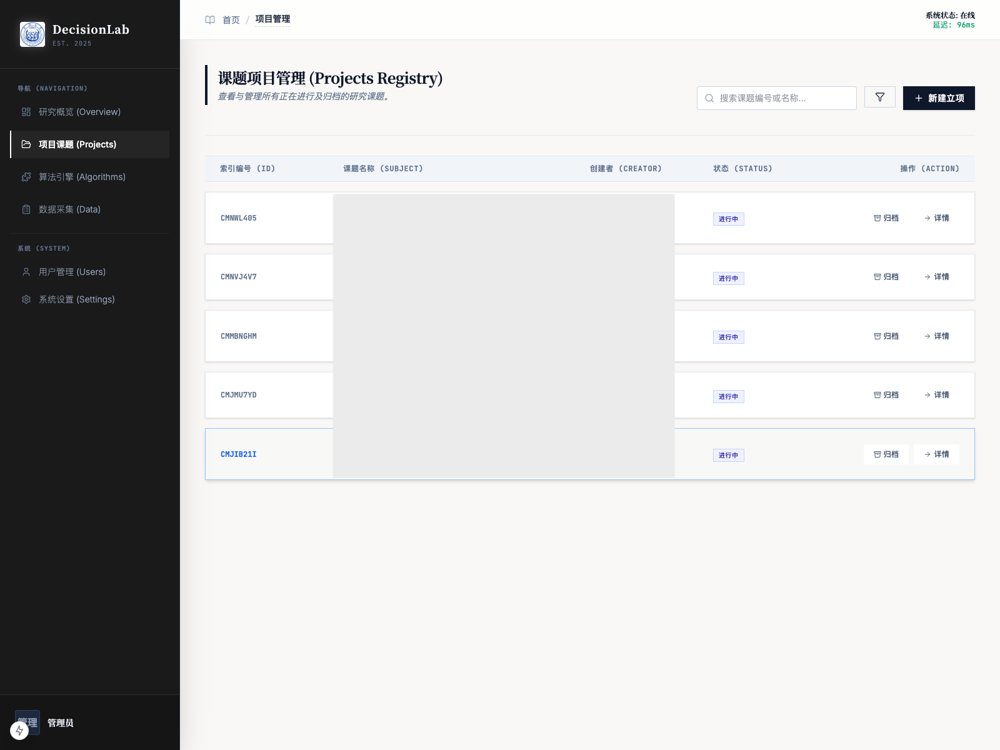
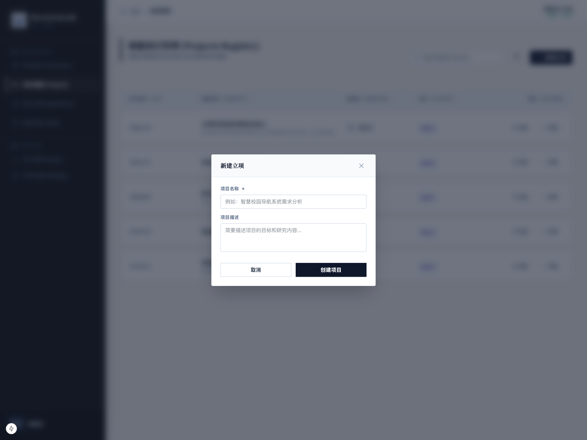
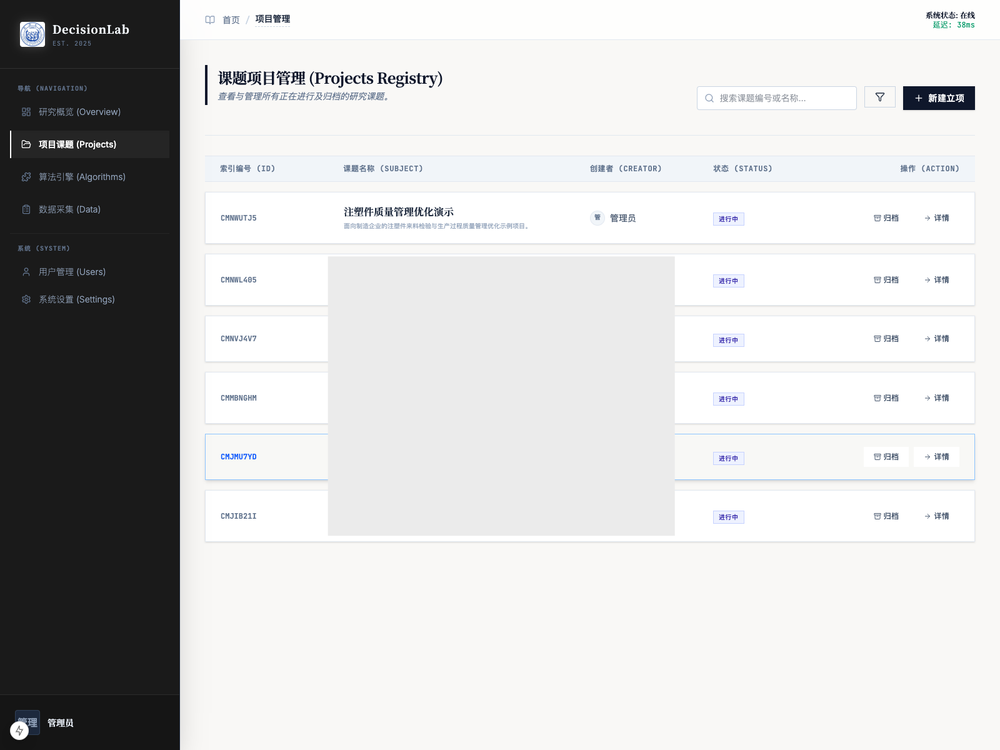
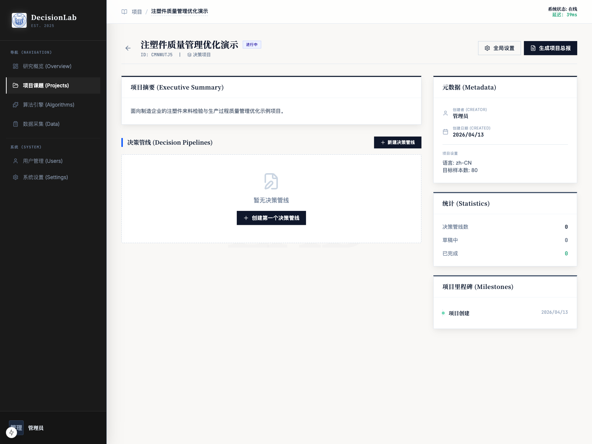

# 创建项目

## 1. 文档用途

本说明用于帮助您在平台中创建一个全新的研究项目，并认识项目页面上最常用的入口和按钮。  
如果您是第一次使用系统，建议先完成本页，再继续阅读“创建管线”“与 AI 交互”“发布问卷”等后续章节。

## 2. 您将在本页完成什么

阅读完本页后，您可以完成以下事情：

1. 进入项目课题页面。
2. 新建一个项目。
3. 填写项目名称和项目说明。
4. 判断项目是否创建成功。
5. 打开项目详情页，了解后续工作的主要入口。

本页示例使用的项目为：

- 项目名称：`注塑件质量管理优化演示`
- 项目描述：`面向制造企业的注塑件来料检验与生产过程质量管理优化示例项目。`

## 3. 操作前准备

开始前，请先确认以下事项：

1. 您已经登录系统。
2. 您已经想好本次研究的主题名称。
3. 您能用一句话说明本项目要解决什么问题、服务哪些业务场景。

如果您暂时不知道项目描述怎么写，也可以先用简洁版本。后续进入项目后，仍可以继续完善研究内容。

## 4. 分步操作

### 第一步：进入“项目课题”

在系统左侧导航栏中，点击“项目课题”。

操作后，您会看到项目列表页。这里会展示您当前可查看的项目，每一个项目都以项目卡片的形式呈现。

如果这是您第一次使用系统，列表可能较少；如果系统中已有历史项目，也不影响您新建自己的项目。

### 第二步：点击“新建立项”

在项目列表页右上方，点击“新建立项”按钮。

操作后，系统会弹出新建项目的填写窗口，请您输入项目名称和项目描述。

填写建议如下：

1. 项目名称尽量简洁，直接表达研究主题。
2. 项目描述建议写清楚研究对象、业务背景和目标方向。
3. 如果后续会创建多条管线，项目名称建议保持稳定，不要写得过细。

### 第三步：填写项目名称和项目描述

在本次示例中，填写方式如下：

1. 项目名称填写：`注塑件质量管理优化演示`
2. 项目描述填写：`面向制造企业的注塑件来料检验与生产过程质量管理优化示例项目。`

填写完成后，点击确认创建。

操作后，系统会返回项目列表，并出现刚刚创建的新项目。

### 第四步：确认项目是否创建成功

回到项目列表后，请重点检查以下内容：

1. 列表中是否出现新项目名称。
2. 项目卡片中是否显示正确的项目描述。
3. 项目卡片是否可以点击进入详情页。

如果这三项都正常，说明项目已经创建成功。

### 第五步：进入项目详情页

点击刚创建好的项目卡片，进入项目详情页。

操作后，您会看到该项目的详细页面。这里是后续创建管线、管理研究过程和查看项目信息的主要工作区。

在项目详情页中，您暂时只需要先关注“新建决策管线”入口。后续真正开始问卷研究时，会从这里进入下一步。

## 5. 页面上的关键按钮说明

以下是本页最常用、最值得先认识的按钮和入口：

- `项目课题`：进入项目列表，是所有研究项目的总入口。
- `新建立项`：新建一个独立项目。建议每个研究主题单独建项目，避免不同课题混在一起。
- `项目卡片`：点击后进入项目详情页，用于继续创建管线和管理该项目。
- `新建决策管线`：在项目下新增一条具体研究流程。一个项目下可以有一条，也可以有多条。
- `全局设置`：用于查看或调整项目层面的基础设置。第一次使用时可先不处理。
- `生成项目总报`：用于后续汇总项目成果。刚创建项目时通常还不需要使用。

## 6. 完成后您会看到什么

完成本页操作后，您通常会看到以下结果：

1. 项目列表里新增了一张属于您的项目卡片。
2. 项目详情页可以正常打开。
3. 项目详情页中已经出现“新建决策管线”入口。

这表示项目层已经准备完成，下一步可以开始建立具体研究流程。

## 7. 常见问题

### 项目名称应该写业务部门名，还是研究主题名？

更建议写研究主题名。  
因为同一个部门以后可能会做多项研究，按主题命名更容易区分。

### 项目描述一定要写得很长吗？

不需要。  
只要能让团队成员看懂“这是研究什么的、为了什么而建”，就已经足够。

### 如果系统里已经有类似项目，我还要重新建吗？

如果本次要作为新的正式研究任务，建议重新建立一个独立项目。  
这样可以保证后续管线、问卷、样本和结果彼此独立，便于管理和复盘。

### 创建成功后没有看到项目怎么办？

您可以先检查：

1. 是否真的点击了确认创建。
2. 项目名称是否和已有项目重复，导致您一时没有分辨出来。
3. 当前是否仍停留在旧页面，尝试返回“项目课题”再次查看。

## 8. 使用建议

1. 一个正式研究主题建议对应一个独立项目。
2. 项目名称尽量稳定，避免频繁改动。
3. 项目描述优先写业务目标，不必一开始就写得非常学术化。
4. 如果后续准备做多个版本的问卷，可以在同一个项目下创建多条不同管线，而不是反复新建项目。
