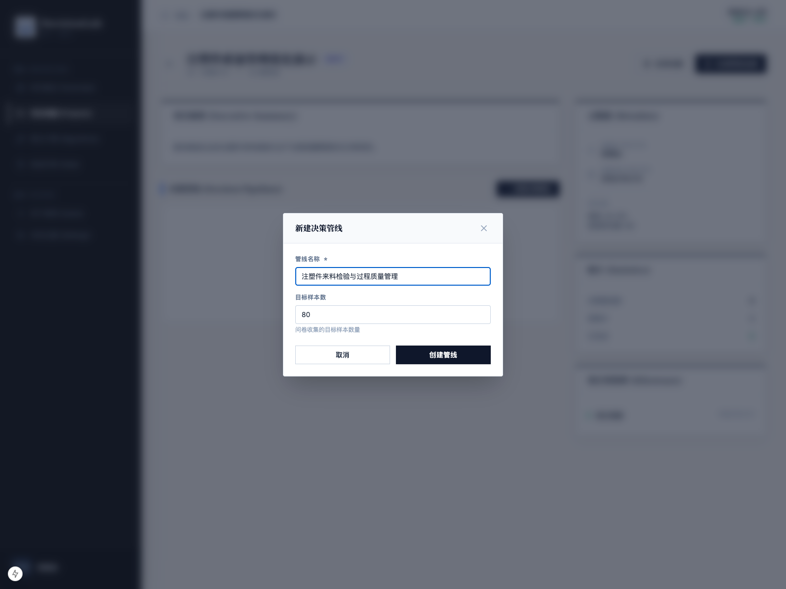
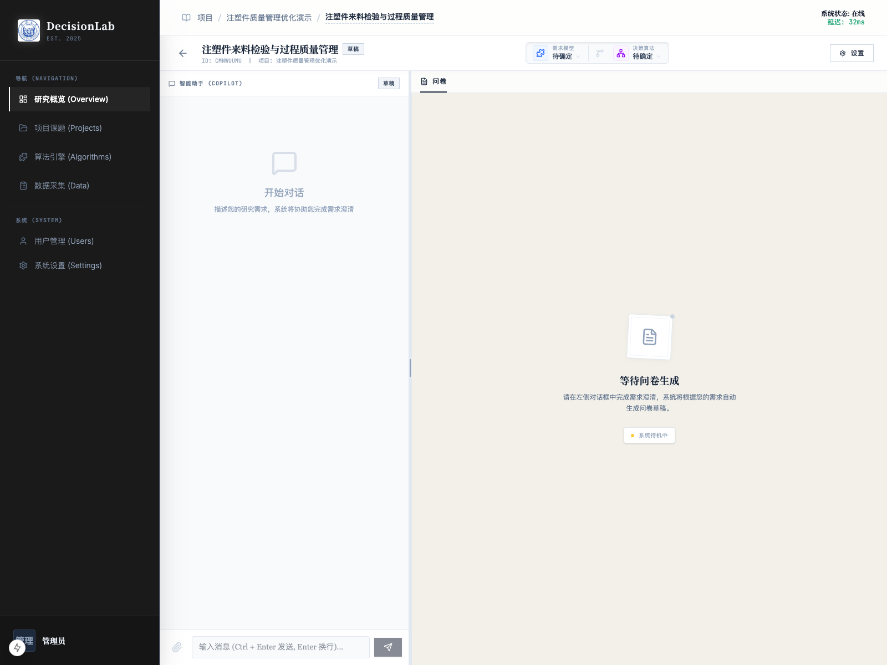

# 创建管线

## 1. 文档用途

本说明用于帮助您在已经创建好的项目下，新建第一条决策管线，并认识管线页中最关键的区域和按钮。  
管线可以理解为“这次研究的具体执行路线”，后续的 AI 澄清、问卷生成、发布和采集都会围绕管线进行。

## 2. 您将在本页完成什么

阅读完本页后，您可以完成以下事情：

1. 理解什么是管线。
2. 在项目中创建一条新管线。
3. 填写管线名称和目标样本数。
4. 进入管线详情页，认识页面结构。
5. 知道首次进入后应该先看哪里。

本页示例使用的项目和管线为：

- 项目：`注塑件质量管理优化演示`
- 管线：`注塑件来料检验与过程质量管理`
- 目标样本数：`60`

## 3. 操作前准备

开始前，请先确认：

1. 您已经完成项目创建。
2. 您已经进入该项目的详情页。
3. 您大致知道本次研究要面向哪一类对象发放问卷。

如果您只做一轮研究，一条管线通常就够用。  
如果您后续想比较不同问卷版本、不同人群或不同研究方向，可以在同一个项目下创建多条管线。

## 4. 分步操作

### 第一步：在项目详情页点击“新建决策管线”

进入项目详情页后，找到页面中的“新建决策管线”按钮并点击。

操作后，系统会弹出新建管线的填写窗口。

### 第二步：填写管线名称

管线名称建议写成“本轮研究最具体的主题”。  
它通常比项目名称更聚焦，能明确告诉团队：这条管线到底研究哪一个问题。

本次示例中，管线名称填写为：

- `注塑件来料检验与过程质量管理`

这样的命名方式有两个好处：

1. 一眼就能看出它聚焦于注塑件质量管理。
2. 后续如果项目里再做“供应商质量协同”“售后质量反馈”等方向，也能清晰区分。

### 第三步：填写目标样本数

目标样本数用于表达“您希望本轮问卷最终收回多少份有效样本”。

本次示例填写为：

- `60`

这并不是硬性限制，而是一个研究目标。  
后续在数据采集页面，系统会根据这个数字展示完成进度，方便您判断当前采集还差多少。

### 第四步：确认创建

填写完成后，点击确认创建。

操作后，系统会自动进入这条新管线的详情页。

### 第五步：认识管线初始页

首次进入新管线时，您会看到页面大致分成两部分：

1. 左侧是 AI 助手区域，用于描述研究背景、回答追问、生成问卷。
2. 右侧是问卷区域，用于查看系统生成的问卷内容。

在刚创建完成、还没有开始澄清需求时，右侧通常会显示等待提示，提醒您先在左侧补充研究信息。

此时，最重要的动作不是急着发布问卷，而是先把研究背景说明清楚。  
只有背景清晰，系统后续推荐的算法和生成的问卷才更贴近您的实际业务。

## 5. 页面上的关键按钮说明

首次创建管线时，建议您先认识以下几个位置：

- `新建决策管线`：在项目详情页中新增一条研究流程。
- `管线名称`：用于区分不同研究主题，后续在项目内和数据采集页都会看到。
- `目标样本数`：用于设置预期收集规模，方便后续看进度。
- `需求模型`：系统根据您的研究特点匹配的需求分析方法，后续会自动显示结果。
- `决策算法`：系统为本次研究匹配的决策方法，通常在澄清完成后自动确定。
- `设置`：用于查看这条管线的配置入口。首次使用时可以先认识位置，不必急于调整。
- `智能助手`：与 AI 进行需求澄清、问卷生成和问卷修改的主要区域。

## 6. 完成后您会看到什么

完成本页操作后，您会看到以下结果：

1. 项目详情页中新增了一条管线。
2. 系统自动进入这条管线的详情页。
3. 页面已经准备好接收您的研究背景说明。

这说明“研究框架”已经建立完成，下一步可以开始与 AI 交互，逐步形成正式问卷。

## 7. 常见问题

### 一个项目下为什么可以有多条管线？

因为同一个项目下，您可能会进行不同轮次、不同人群、不同问卷版本的研究。  
用多条管线分别管理，会更清楚，也更方便比较结果。

### 管线名称和项目名称可以一样吗？

可以，但不建议。  
项目名称通常代表大主题，管线名称更适合写得具体一些。

### 目标样本数填大了或填小了，会影响问卷生成吗？

通常不会影响问卷内容本身。  
它主要影响您后续查看采集进度时的参照标准。

### 创建管线后右侧没有问卷，是不是出错了？

不是。  
新管线刚创建完成时，系统通常还没有足够信息生成问卷。您需要先在左侧向 AI 说明研究背景。

## 8. 使用建议

1. 一条管线尽量只服务一个明确研究目的。
2. 管线名称建议写得比项目名称更具体。
3. 目标样本数最好根据实际可触达人数来估算，不要只写理想值。
4. 新建管线后，先做需求澄清，再生成问卷，顺序不要颠倒。
