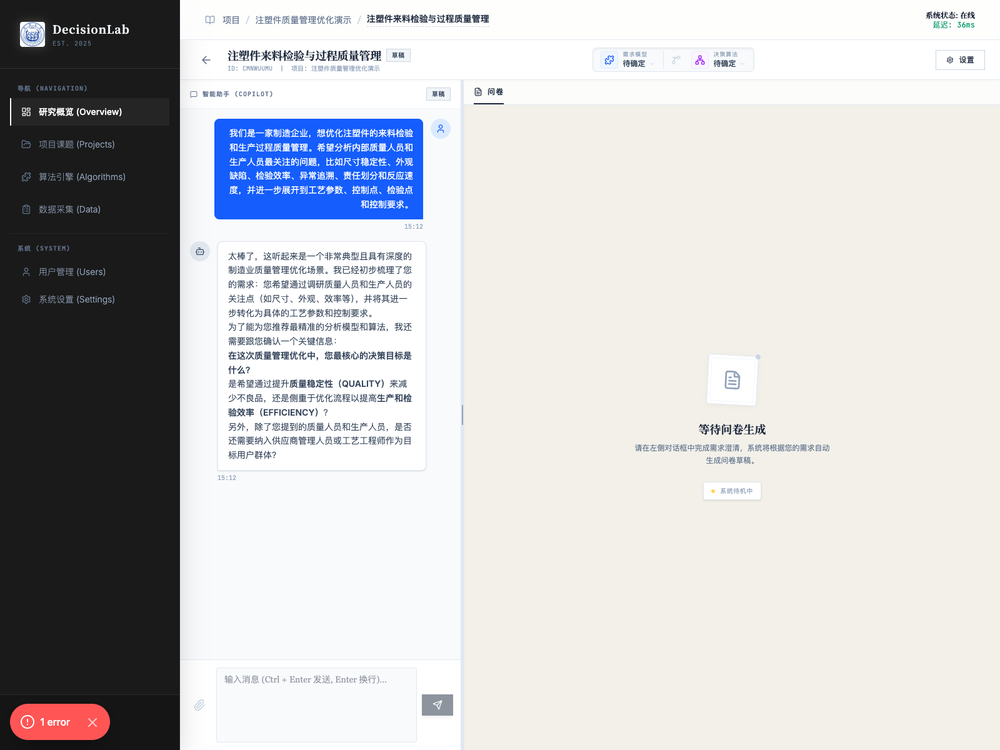
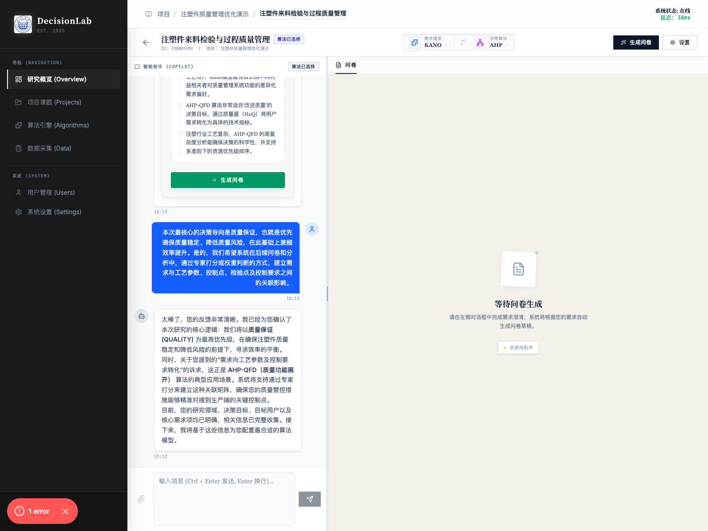
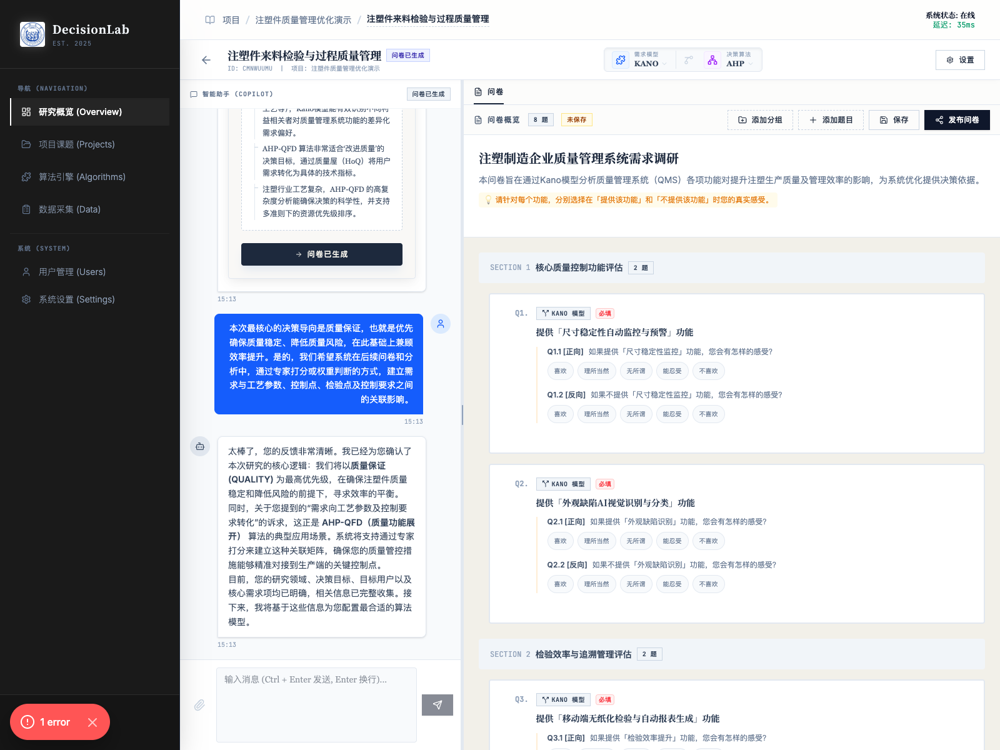
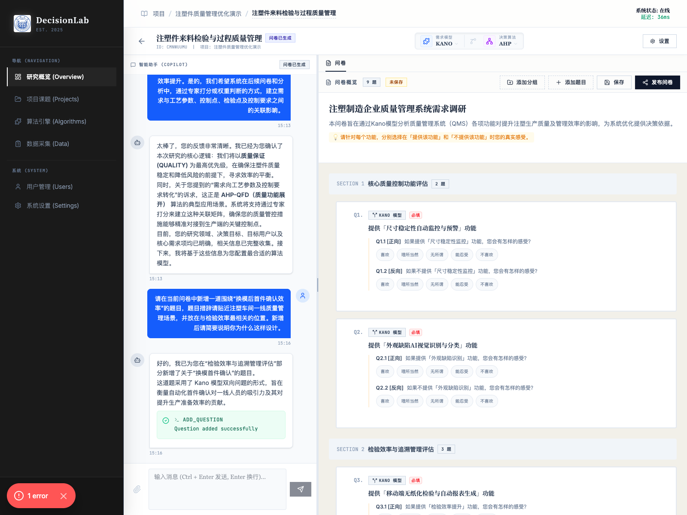
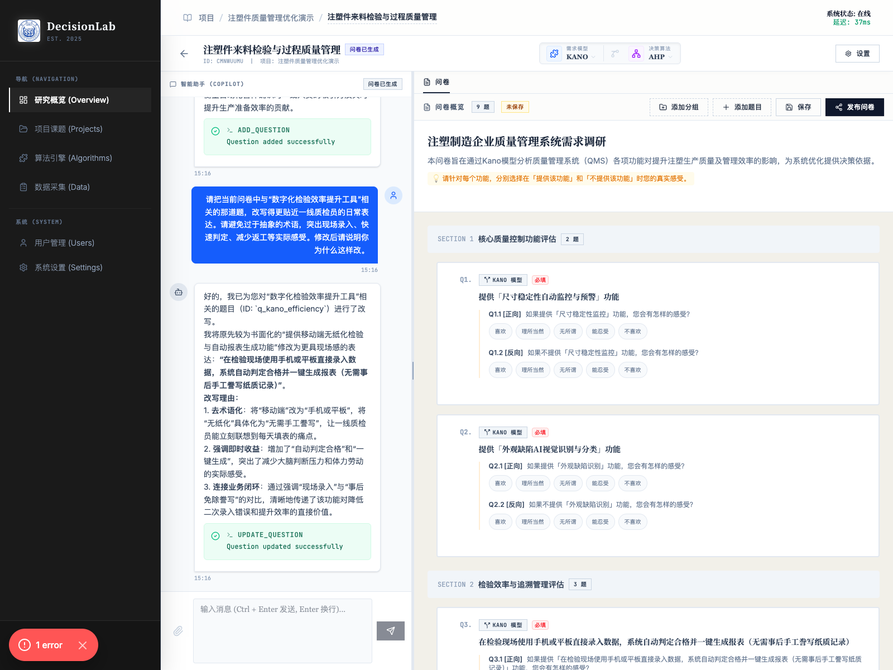
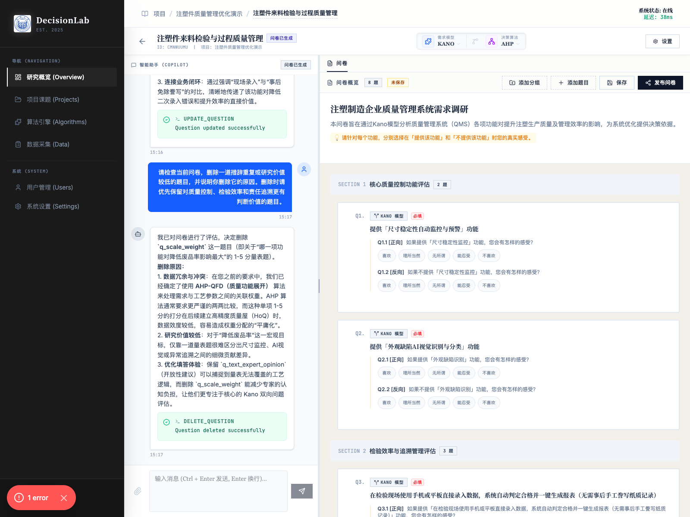

# 与 AI 交互

## 1. 文档用途

本说明用于帮助您在管线详情页中，与 AI 清楚说明研究背景、完成需求澄清、生成问卷，并在问卷生成后继续让 AI 帮您新增、修改和删除题目。  
AI 在这里的角色更像是一位协助整理研究思路的助手，它能帮助您更快产出问卷草稿，但最终是否采用，仍建议由您结合业务判断来确认。

## 2. 您将在本页完成什么

阅读完本页后，您可以完成以下事情：

1. 向 AI 说明研究背景。
2. 回答 AI 的补充追问。
3. 判断算法匹配是否完成。
4. 让系统生成问卷。
5. 让 AI 新增、修改、删除问卷题目。
6. 检查 AI 的修改是否已经真正体现在问卷中。

本页示例使用的管线为：

- 管线：`注塑件来料检验与过程质量管理`

## 3. 操作前准备

开始前，建议您先准备好以下信息：

1. 您来自什么行业或业务场景。
2. 本次研究想解决什么问题。
3. 主要调研哪些角色或人群。
4. 您更看重质量、效率、风险控制中的哪一项。
5. 您希望问卷最终用于什么分析。

这些信息越清楚，AI 生成的问卷就越贴近您的真实需要。

## 4. 分步操作

### 第一步：先把研究背景说清楚

进入管线详情页后，在左侧“智能助手”输入框中直接描述您的研究背景。

第一次输入时，建议至少包含以下四类信息：

1. 您是什么类型的单位或团队。
2. 您想优化什么业务环节。
3. 您最关心哪些问题。
4. 您希望问题最终延伸到哪些分析维度。

本次示例的首次输入如下：

```text
我们是一家制造企业，想优化注塑件的来料检验和生产过程质量管理。希望分析内部质量人员和生产人员最关注的问题，比如尺寸稳定性、外观缺陷、检验效率、异常追溯、责任划分和反应速度，并进一步展开到工艺参数、控制点、检验点和控制要求。
```

操作后，AI 会先理解您的场景，再根据缺失信息发起追问。



### 第二步：回答 AI 的补充追问

如果 AI 继续追问，这通常意味着系统正在进一步确认研究重点，以便后续推荐更合适的分析方法。

本次示例中，我们补充说明了研究目标、人群范围和业务边界，示例如下：

```text
本次研究的核心目标是更严苛地管控产品质量并降低质量风险，同时兼顾检验效率提升。目标群体包括质量人员、生产人员、工艺工程师、车间主管和管理层，暂不包含供应商。
```

如果 AI 继续追问“您更偏向质量保证还是效率提升”等问题，您可以进一步明确主次关系。  
本次示例中，又补充了如下说明：

```text
本次最核心的决策导向是质量保证，也就是优先确保质量稳定、降低质量风险，在此基础上兼顾效率提升。是的，我们希望系统在后续问卷和分析中，通过专家打分或权重判断的方式，建立需求与工艺参数、控制点、检验点及控制要求之间的关联影响。
```

您的原则可以很简单：  
只要回答清楚“最优先的目标是什么、研究对象是谁、问卷想支撑什么判断”，通常就足够了。

### 第三步：判断算法匹配是否完成

当系统完成理解后，页面上会出现算法匹配成功的提示，同时顶部会显示需求模型和决策算法。

本次示例中，系统自动匹配到了：

- 需求模型：`KANO`
- 决策算法：`AHP`

这时说明系统已经具备生成问卷的条件。



如果您还想继续补充背景，也可以在这个阶段继续输入。  
如果主要信息已经清楚，就可以进入下一步。

### 第四步：点击“生成问卷”

在页面上方点击“生成问卷”。

操作后，系统会根据您前面提供的背景信息和已匹配的分析方法，自动整理出一版问卷草稿。



这时建议您先快速检查以下事项：

1. 题目是否围绕您真正关心的问题。
2. 题目表达是否贴近被调研对象。
3. 是否有明显重复、过空或过难理解的题目。

### 第五步：让 AI 新增题目

如果您发现有关键问题没有覆盖，可以直接要求 AI 新增题目。

本次示例中，我们要求 AI 增加一题，聚焦“换模后首件确认效率”。推荐输入示例如下：

```text
请在当前问卷中新增一道围绕“换模后首件确认效率”的题目，题目措辞请贴近注塑车间一线质量管理场景，并放在与检验效率最相关的位置。新增后请简要说明你为什么这样设计。
```

操作后，请不要只看 AI 的文字回复，更要看右侧问卷中是否真的新增了题目。  
本次示例中，系统把新增题目插入到了“检验效率与追溯管理评估”部分。



### 第六步：让 AI 修改题目表达

如果题目方向是对的，但表达不够贴近实际工作场景，您可以让 AI 重写题目。

本次示例中，我们要求 AI 把与“数字化检验效率提升工具”相关的题目，改写得更贴近一线质检员的日常表达。推荐输入示例如下：

```text
请把当前问卷中与“数字化检验效率提升工具”相关的那道题，改写得更贴近一线质检员的日常表达。请避免过于抽象的术语，突出现场录入、快速判定、减少返工等实际感受。修改后请说明你为什么这样改。
```

操作后，建议您重点检查：

1. 新题目是否更容易被现场人员理解。
2. 是否保留了原本想衡量的核心意思。
3. 问卷结构和位置是否仍然合理。



### 第七步：让 AI 删除不必要的题目

如果题目存在重复、研究价值偏低，或会增加受访者负担，您可以让 AI 帮您删除。

本次示例的推荐输入如下：

```text
请检查当前问卷，删除一道措辞重复或研究价值较低的题目，并说明你删除它的原因。删除时请优先保留对质量控制、检验效率和责任追溯更有判断价值的题目。
```

操作后，仍然建议您回到右侧问卷确认：

1. 题目数量是否发生变化。
2. 被删除的内容是否确实可以不保留。
3. AI 给出的删除理由是否合理。



### 第八步：检查 AI 修改是否真正生效

很多用户会只看左侧聊天回复，而忽略右侧问卷本体。  
更稳妥的做法是，每次让 AI 调整后，都检查右侧问卷中对应的题目是否真的变了。

您可以重点看：

1. 题目标题是否已变化。
2. 题目顺序是否合理。
3. 分组位置是否符合您的研究逻辑。
4. 是否仍然保留了原先必须调研的关键内容。

## 6. 常见问题

### 第一次应该对 AI 说多详细？

不必追求一次说得非常完整。  
只要先把行业、目标、对象和关键关注点说清楚，AI 会继续追问缺少的信息。

### AI 追问很多，是不是我输入得不对？

不一定。  
很多时候，追问是系统在帮您把研究目标进一步聚焦，这是正常流程。

### AI 生成的问卷可以直接发布吗？

可以作为起点，但不建议完全不看就直接发布。  
最好先检查题目是否贴合业务场景，是否有重复、过难或过空的问题。

### AI 改了题目，我怎么确认真的改成功了？

请直接查看右侧问卷内容，而不是只看左侧聊天回复。  
只有问卷本体中的题目发生变化，才算真正生效。

### AI 会替我做最终判断吗？

不会。  
AI 更适合帮助您整理、改写和补充。最终是否保留某道题，仍建议由您结合研究目标来决定。

## 7. 使用建议

1. 与 AI 交互时，优先讲清楚业务目标，而不是只讲想做什么功能。
2. 每次只提一个明确修改要求，效果通常更好。
3. 让 AI 改题后，一定回到问卷本体核对结果。
4. 对关键题目，建议以“是否有助于后续决策”为标准来取舍。
5. 把 AI 当作协助整理的助手，而不是替代业务判断的决策者。
