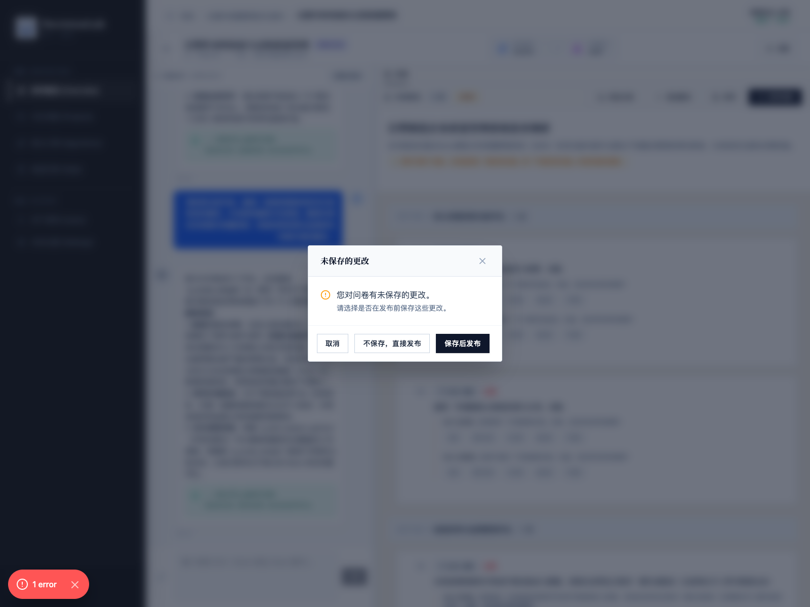
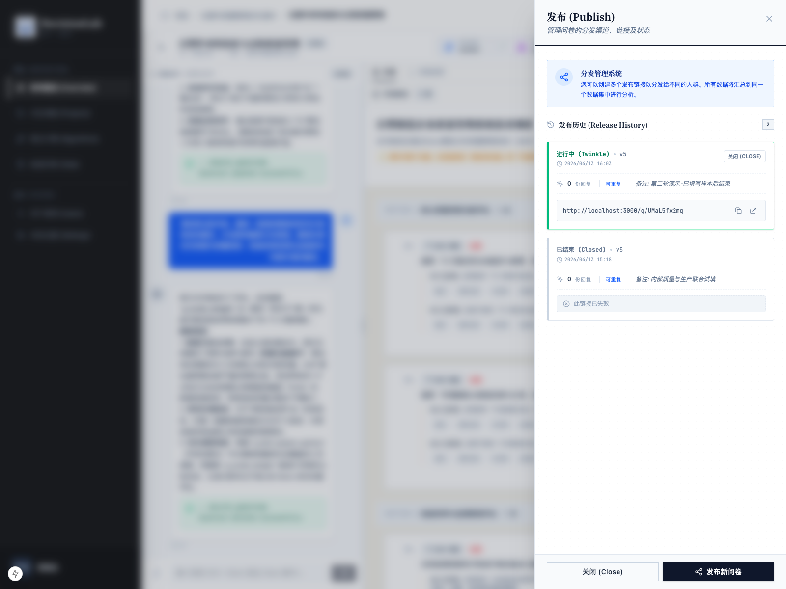
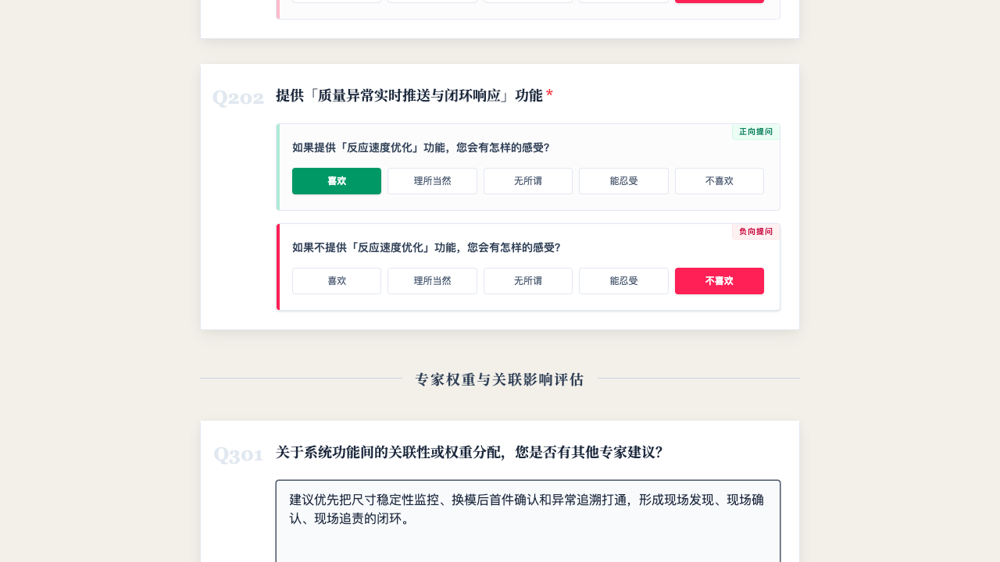
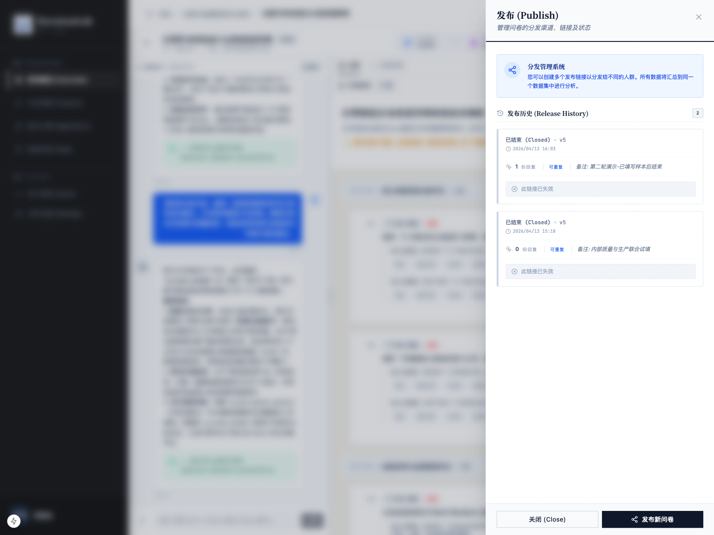
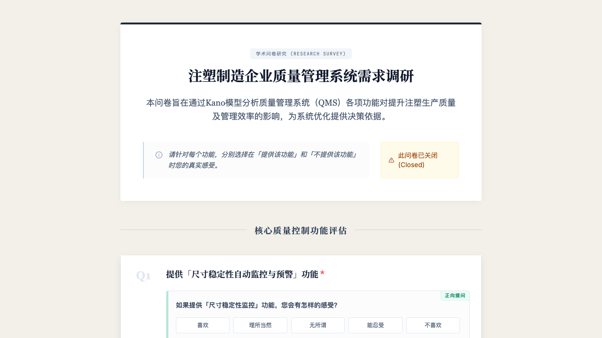
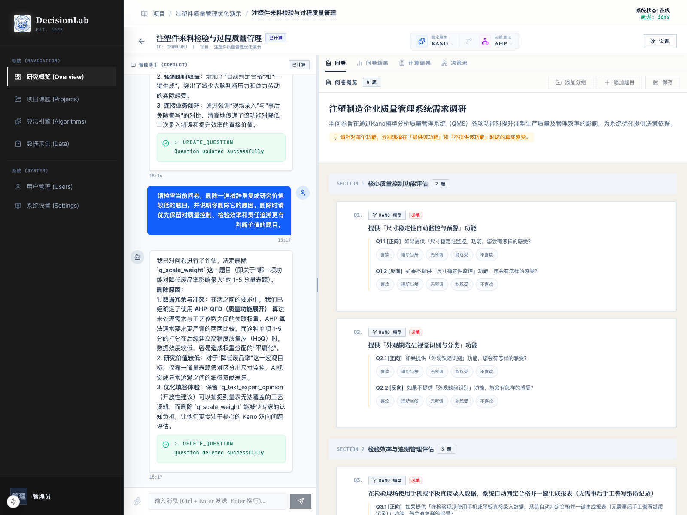
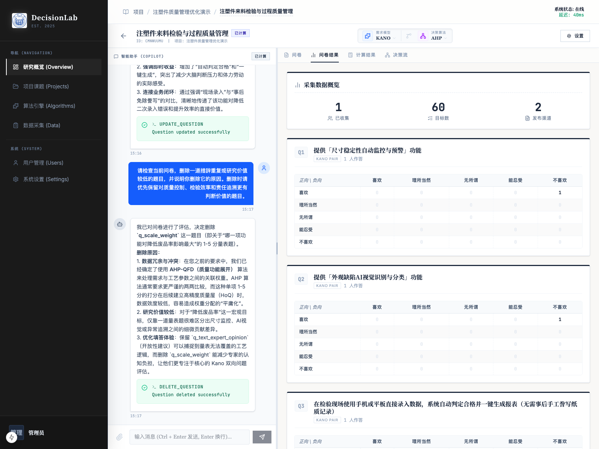

# 发布问卷

## 1. 文档用途

本说明用于帮助您把已经确认好的问卷正式发布出去，生成可填写的公开链接，并学会查看当前采集状态、提前结束问卷。  

## 2. 您将在本页完成什么

阅读完本页后，您可以完成以下事情：

1. 判断问卷是否已经具备发布条件。
2. 处理“未保存更改”的提示。
3. 配置发布选项并正式发布。
4. 在管线详情里查看发布历史、公开链接和当前状态。
5. 打开公开问卷页进行检查，并先填写至少 1 份测试样本。
6. 在管线详情里确认当前回复数。
7. 在管线详情里提前结束问卷采集。
8. 在管线详情里生成计算结果。
9. 在管线详情里查看问卷结果。

## 3. 操作前准备

正式发布前，建议先确认以下事项：

1. 问卷已经生成。
2. 重要题目已经检查过，措辞没有明显问题。

如果您准备把问卷发给多个不同群体，也不必担心。  
系统支持创建多个发布链接，并统一汇总到同一个数据集中分析。

## 4. 分步操作

### 第一步：确认问卷已经可以发布

当问卷已经生成并且内容检查通过后，页面右上区域会出现“发布问卷”按钮。

如果您刚刚做过新增、修改、删除题目等调整，系统可能会先提醒您还有改动没有保存。

### 第二步：处理“未保存更改”提示

点击“发布问卷”后，如果系统检测到您有尚未保存的修改，会弹出提醒窗口。

操作后，您会看到系统明确提示：当前还有未保存更改，并询问您是否先保存再发布。

在这种情况下，建议选择“保存后发布”。  
这样可以避免您刚刚修改过的内容没有真正进入发布版本。

### 第三步：进入发布配置页面

保存完成后，系统会进入发布页面。  
如果这是第一次发布，您会先看到发布历史为空，然后点击“发布新问卷”继续。

随后，系统会打开发布配置页面。

在这里，您会看到两个常用配置项：

1. `允许重复填写`
2. `备注`

它们分别是什么意思，请看下面的说明。

### 第四步：设置“允许重复填写”和“备注”

#### 允许重复填写

如果勾选“允许重复填写”，表示同一浏览器可以多次提交这份问卷。  
这种方式更适合现场试填或一个设备需要多人轮流填写的场景。

如果取消勾选，则更适合正式调查场景，可以减少同一浏览器重复提交的情况。

#### 备注

备注不是给受访者看的，而是给您自己做发布管理用的。  
建议用来标记这次链接的投放渠道或用途，例如：

1. 质量部微信群
2. 线下培训现场
3. 生产班组试填

本次示例中，备注填写为：`第二轮演示-已填写样本后结束`

填写完成后，点击“确认发布”。

### 第五步：查看发布成功后的链接和状态

发布成功后，系统会在发布历史中新增一条记录，并显示：

1. 当前状态
2. 发布时间
3. 回复份数
4. 备注
5. 公开链接

本次示例中，系统生成了公开链接，并显示当前状态为“进行中”。

如果您后续还要面向其他渠道继续发放，可以继续创建新的发布链接。  
这些链接的数据会汇总到同一条问卷版本中。

### 第六步：打开公开问卷页检查填写体验

发布后，建议您先自己打开公开链接，确认页面可以正常访问、题目展示正常。

本次示例的公开填写页如下：

### 第七步：交由目标用户填写

本次示例中，我们先通过公开链接实际提交了 1 份问卷，然后再回到管线详情继续查看状态和结束采集。

### 第八步：在管线详情里确认当前状态和回复数

回到管线详情后，再次点击“发布问卷”，进入发布历史。

操作后，您会看到当前发布记录中的关键信息，例如：

1. 当前状态是否为“进行中”。
2. 当前已经收到多少份回复。
3. 公开链接和备注是否正确。

本次示例中，发布历史已显示这条链接收到 `1 份回复`。

### 第九步：在管线详情里结束采集

如果您已经完成试填，或本轮采集准备结束，可以继续在发布历史中点击当前这条发布记录右侧的“关闭”。

点击后，系统会弹出确认提示，说明关闭后该链接将不能继续填写。

如果您确认要结束，点击“确认关闭”。

### 第十步：确认结束后的状态变化

关闭完成后：

1. 在管线详情的发布历史里，确认状态已从“进行中”变成“已结束”。
2. 再次打开公开链接，确认外部填写页已经不能继续提交。

本次示例中，管线详情中的发布记录已经切换为“已结束”，同时仍保留 `1 份回复` 的记录。

同时，重新打开公开链接后，页面会显示“此问卷已关闭”，提交按钮也会不可用。

这说明提前结束已经生效，系统不会再继续接收新的填写结果。

### 第十一步：在管线详情里生成计算结果

当您已经有了至少 1 份有效回复，并且本轮采集已经结束后，就可以回到管线详情页，点击顶部的“生成计算结果”。

操作后，系统会开始处理本轮问卷数据。  
处理完成后，页面上会出现“计算结果”入口，表示结果已经生成。

如果您点击后暂时没有立即变化，通常只需要稍等几秒，再查看页面状态即可。

### 第十二步：在管线详情里查看问卷结果

结果生成后，点击页面中的“问卷结果”。

操作后，您会看到每一道题目的汇总结果，例如：

1. 不同选项的分布情况。
2. 各题的回答组合统计。
3. 每道题当前已经收集到的结果表现。

本次示例中，因为我们先提交了 1 份测试样本，所以问卷结果页已经能够显示真实的统计矩阵。

## 5. 页面上的关键按钮说明

- `发布问卷`：进入问卷发布流程。
- `保存后发布`：当问卷有未保存改动时，先保存当前版本，再继续发布。
- `发布新问卷`：在发布历史中新增一个新的分发链接。
- `允许重复填写`：决定同一浏览器是否可以多次提交问卷。
- `备注`：用于标记本次发布渠道或用途，方便后续区分。
- `确认发布`：正式生成公开链接并开始采集。
- `复制链接`：复制公开填写地址，方便转发。
- `访问`：直接打开公开填写页进行检查。
- `关闭`：在管线详情的发布历史中结束某一条发布链接。
- `生成计算结果`：在采集结束后，生成本轮问卷的计算结果。
- `问卷结果`：查看每道题已经收集到的统计结果。

## 6. 完成后您会看到什么

完成本页操作后，您通常会看到以下结果：

1. 系统已经生成可访问的公开问卷链接。
2. 发布历史中出现新的发布记录。
3. 您已经成功提交至少 1 份测试样本。
4. 管线详情中的发布历史能够显示当前回复数。
5. 如果提前结束，状态会切换为“已结束”。
6. 公开填写页也会同步停止接收新提交。
7. 管线详情中可以继续生成计算结果并查看问卷结果。

## 7. 常见问题

### 什么时候算是可以发布？

至少要满足两点：

1. 问卷已经生成。
2. 关键题目已经检查过，没有明显错误。

如果刚做过修改，建议先保存再发布。

### “允许重复填写”应该什么时候勾选？

如果您在做内部试填、演示、培训，或者多个填写者需要共用设备，可以勾选。  
如果是正式调查，通常更建议根据实际情况谨慎使用。

### 发布后还能继续修改问卷吗？

从管理角度看，建议尽量不要在正式采集开始后频繁改动。  
如果必须调整，建议先确认变更对数据一致性的影响。

### 如何判断问卷还在收集？

最直接的方法有两个：

1. 在管线详情中点击“发布问卷”，查看发布历史里是否显示“进行中”。
2. 打开公开链接，确认页面是否还能正常填写和提交。

### 提前结束后还能恢复吗？

点击关闭后，该链接将不能继续填写。  
因此，点击前建议先确认是否真的要停止本轮采集。

## 8. 使用建议

1. 正式转发前，先自己打开一次公开链接检查页面。
2. 备注尽量写清楚投放渠道，后续回看更容易分辨。
3. 提前结束前，先确认是否已经达到本轮研究的最小样本要求。
4. 如果后续还要向其他渠道继续发放，可以重新发布新的链接，而不是继续使用已经关闭的链接。
