# 决策流

## 1. 文档用途

本说明用于帮助您在问卷完成、样本收集并生成计算结果后，继续使用“决策流”功能，把前面的需求分析逐步展开成更适合执行落地的 QFD 决策链。  
本页重点说明：

1. 第一轮每一步如何操作，以及如何与 AI 配合完成。
2. 如何使用“自动驾驶”一次性推进后续轮次。
3. 最后一步“落地映射”的各项功能如何使用。

本页继续使用同一条管线：

- 项目：`注塑件质量管理优化演示`
- 管线：`注塑件来料检验与过程质量管理`

## 2. 您将在本页完成什么

阅读完本页后，您可以完成以下事情：

1. 在管线详情页进入“决策流”。
2. 理解系统为什么会自动进入制造业或服务业蓝图。
3. 完成第一轮的 WHAT、AHP、HOW、质量屋、分析五个步骤。
4. 如何开启自动驾驶。
5. 打开并使用最后一步“落地映射”的不同结果视图。

## 3. 操作前准备

开始前，请先确认以下事项已经完成：

1. 问卷已经生成。
2. 问卷至少已经收集到有效样本。
3. 管线中已经点击过“生成计算结果”。
4. 您已经能在管线中看到“问卷结果”“计算结果”“决策流”这些页签。

如果前面的问卷、样本和计算结果还没有准备好，建议先完成前一篇“发布问卷”中的操作，再进入本页。

## 4. 分步操作

### 第一步：进入“决策流”

在管线详情页顶部的页签区域，点击“决策流”。

操作后，系统会先展示一个启动卡片，用于初始化决策流。

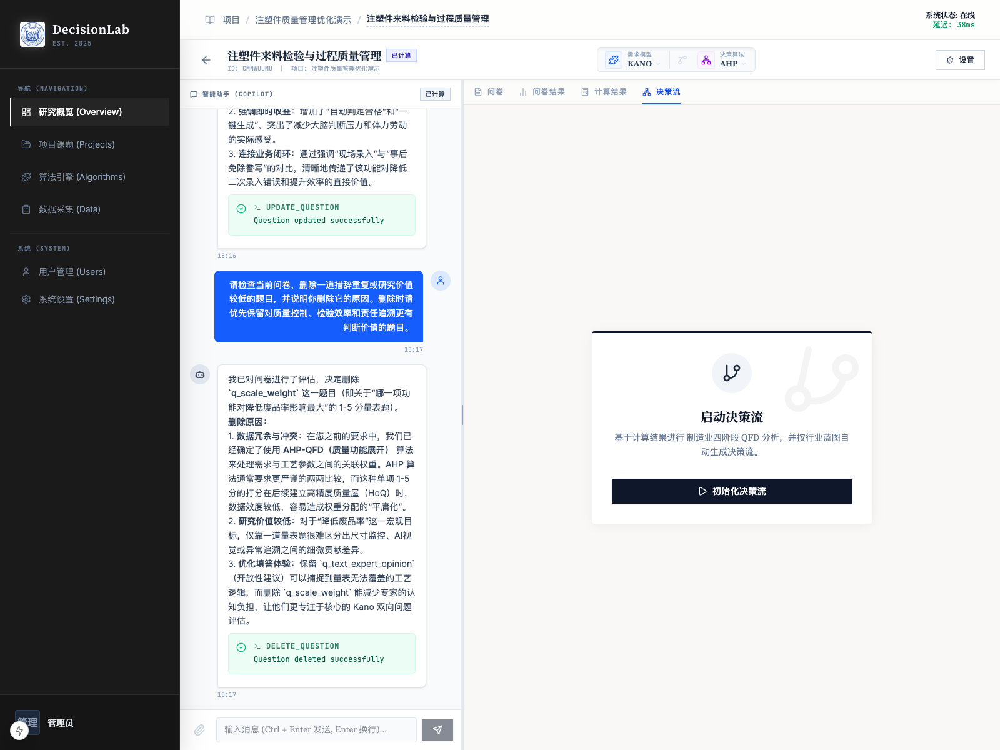

系统会基于当前管线的计算结果和行业上下文，自动选择对应的行业蓝图，再生成决策流。

### 第二步：初始化决策流

在启动卡片中点击“初始化决策流”。

操作后，系统会根据前面的问卷结果和计算结果，创建本条管线的决策流结构，并进入第一轮。

第一轮的步骤条通常包括：

1. `WHAT`
2. `AHP`
3. `HOW`
4. `质量屋`
5. `分析`

在本次制造业示例中，第一轮的总目标是把“用户需求”正式转化为“技术指标”。

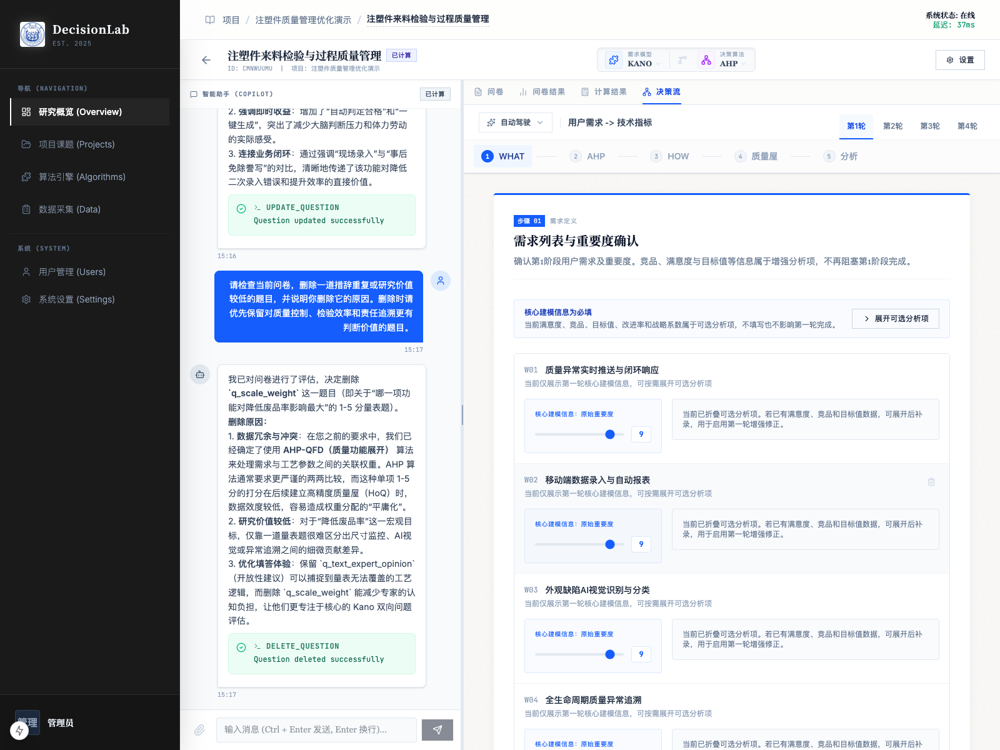

### 第三步：第一轮 WHAT，确认需求列表与重要度

第一轮的 WHAT 页面用于确认本轮的需求项，以及每一项的原始重要度。

在这个页面中，您通常会看到：

1. 系统已经带入的需求项。
2. 每个需求项的原始重要度滑块。
3. “展开可选分析项”按钮。
4. “输入新需求名称”输入框。
5. “确认需求”按钮。

这一页的含义是：  
先确认“这一轮到底分析哪些需求、它们的相对重要程度大概如何”。

这一页与 AI 的联动主要体现在两个方面：

1. 前面问卷和计算结果中的需求项，会自动继承到这里。
2. 您之前与 AI 澄清过的重点诉求，也会影响系统预填的重要度排序。

如果您已经认可当前需求列表，可以直接点击“确认需求”。  
如果您还有想补充的需求，也可以先新增后再确认。

### 第四步：第一轮 AHP，确认权重分配

确认需求后，系统会进入 AHP 权重分析页。

在这一页中，您会看到：

1. 成对比较矩阵。
2. 一致性指标 `CR`。
3. “自动推荐权重”按钮。
4. 下方的权重分布结果。
5. “确认权重”按钮。

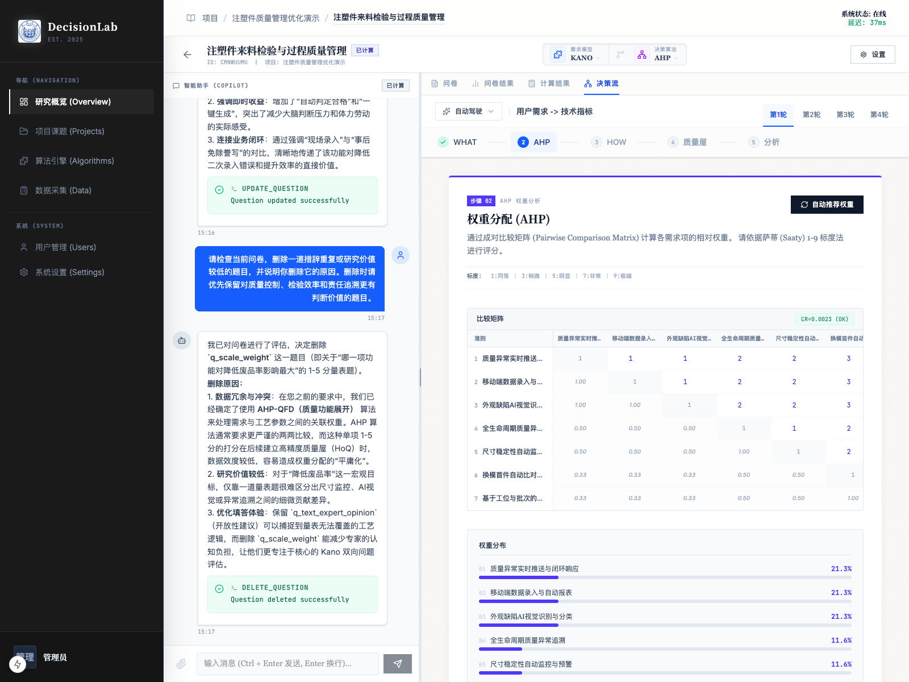

这一页的作用是把“重要度”进一步转成更加正式的相对权重。

这里与 AI 的联动方式是：

1. 系统会先根据前面的需求重要度，给出一版可用的初始矩阵。
2. 如果您不想逐格填写，可以使用“自动推荐权重”作为起点。
3. 您确认矩阵和 CR 正常后，再点击“确认权重”进入下一步。

对大多数首次使用者来说，更稳妥的做法是：

1. 先看 CR 是否正常。
2. 再看排序是否符合业务直觉。
3. 没问题后再确认。

### 第五步：第一轮 HOW，定义技术指标

进入 HOW 后，系统开始把需求展开成技术指标。

您会看到：

1. 技术指标列表区。
2. “输入新技术指标名称”输入框。
3. “添加”按钮。
4. “AI生成技术指标”按钮。
5. 可选的补充说明输入框。
6. “确认指标”按钮。

刚进入 HOW 时，技术指标可能还是空的。

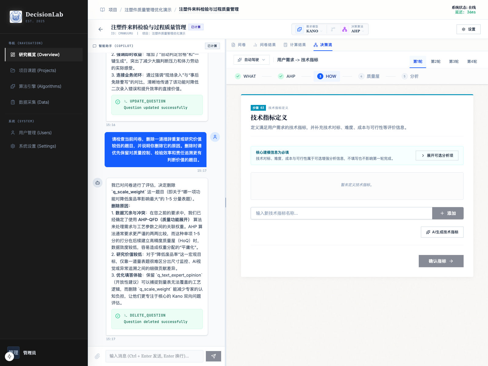

对大多数用户来说，推荐优先用 AI 生成，而不是手工从零填写。  
本次示例中，我们点击“AI生成技术指标”后，系统出现了用于启动生成的区域。

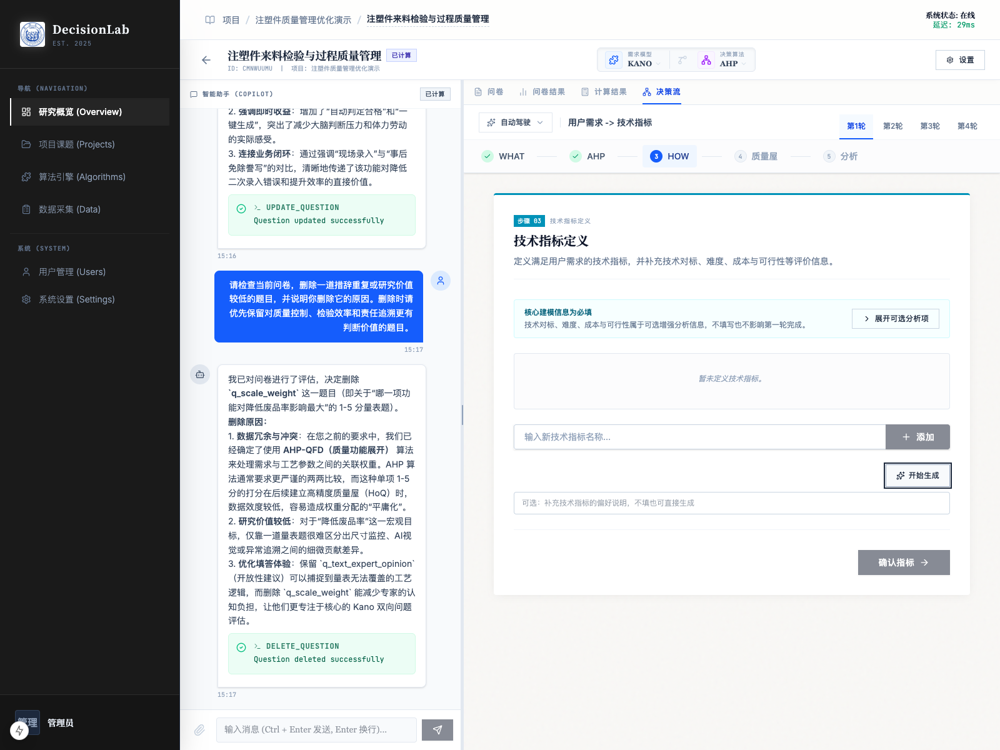

然后点击“开始生成”，系统会自动基于：

1. 前面的研究背景。
2. 问卷中的关键需求。
3. 第一轮已确认的权重结果。

生成一组可编辑的技术指标。

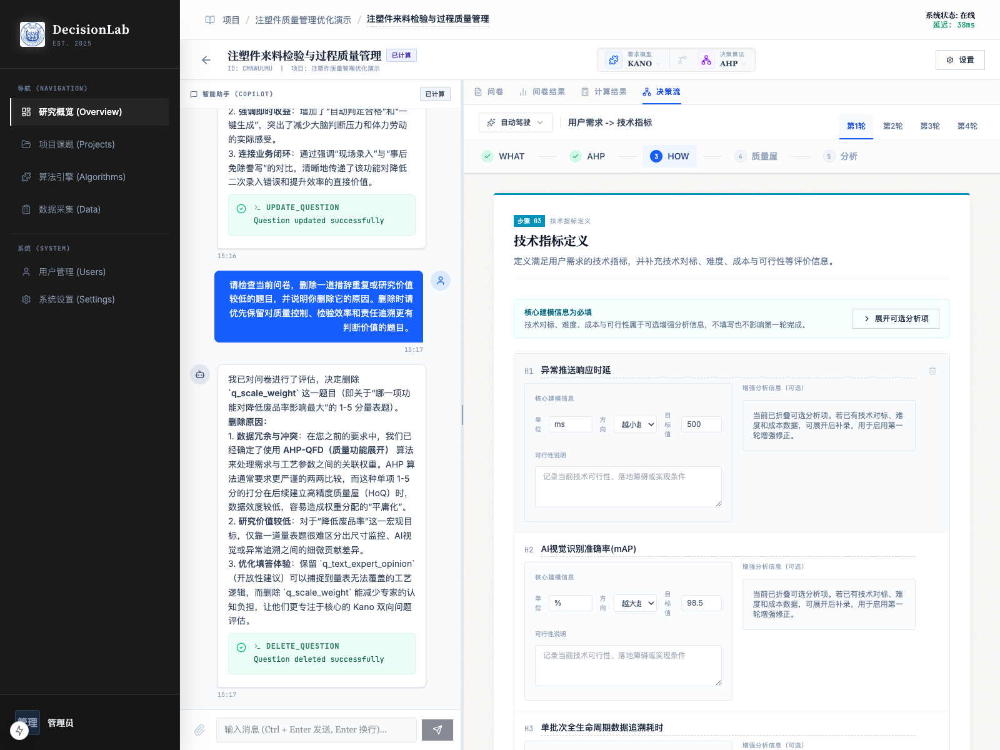

您也可以在左侧的聊天框中向AI描述您想添加的技术指标，AI会帮您进行操作。

### 第六步：第一轮质量屋，建立关系矩阵

确认技术指标后，系统会进入质量屋构建页。

这一页的关键功能包括：

1. 关系矩阵本体。
2. “AI自动填写系数”按钮。
3. “主矩阵视图”与“屋顶矩阵视图”切换。
4. “全屏”“放大”“重置”按钮。
5. “确认质量屋”按钮。

刚进入时，矩阵可能还没有关系值。

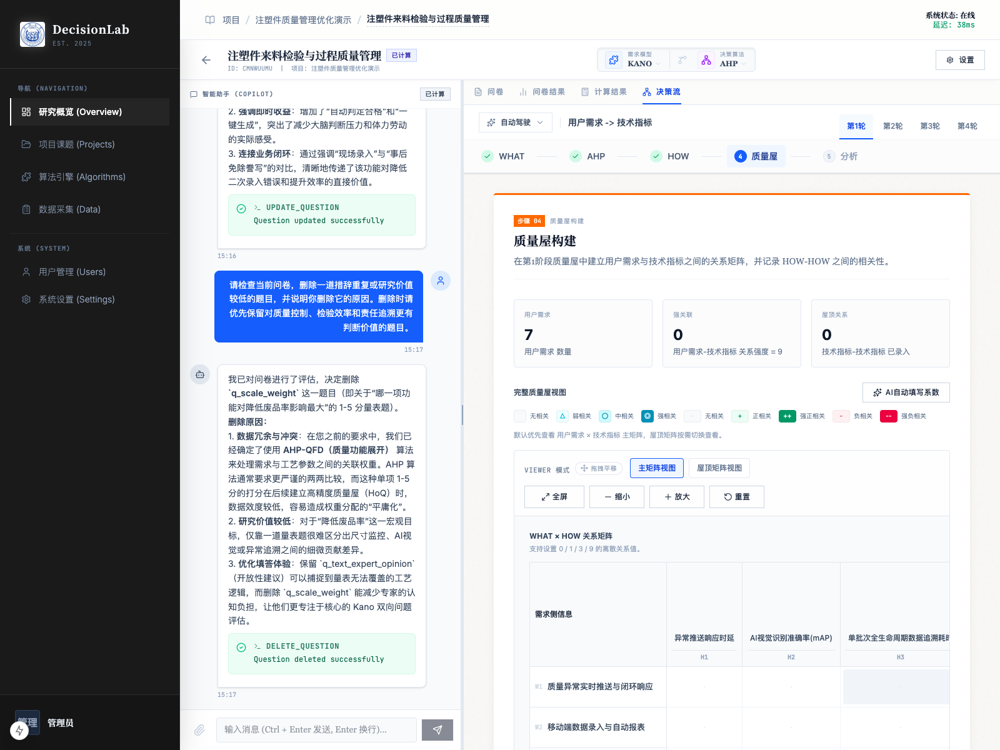

此时推荐直接点击“AI自动填写系数”。  
系统会自动补全：

1. 用户需求与技术指标之间的主矩阵关系。
2. 技术指标之间的协同或冲突关系。

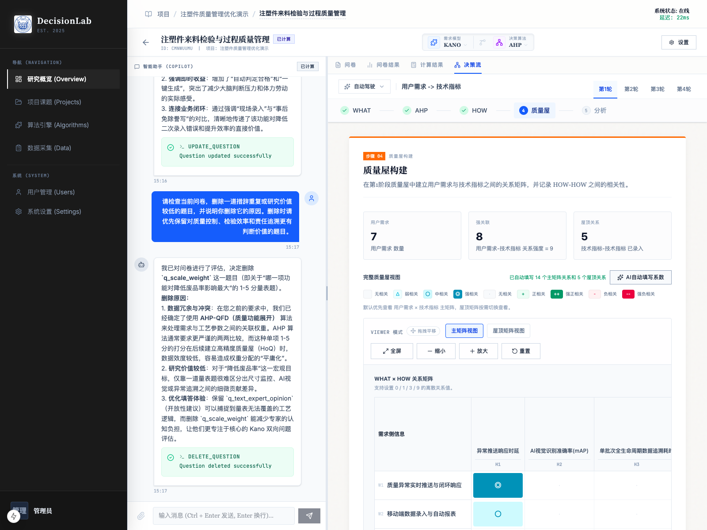

这一页的协作分工可以这样理解：

1. AI 负责先把关系矩阵补齐，帮助您快速建立初稿。
2. 您负责核对强相关、中相关、弱相关是否大体合理。
3. 如果确认没有大问题，再点击“确认质量屋”。

### 第七步：第一轮分析，完成本轮筛选

确认质量屋后，系统会进入分析页。

这一页会把本轮的主要输出整理出来，例如：

1. 本轮 HOW 排名。
2. 本轮 WHAT 权重。
3. 本轮关键对象。
4. 下一轮建议继承的重点项。

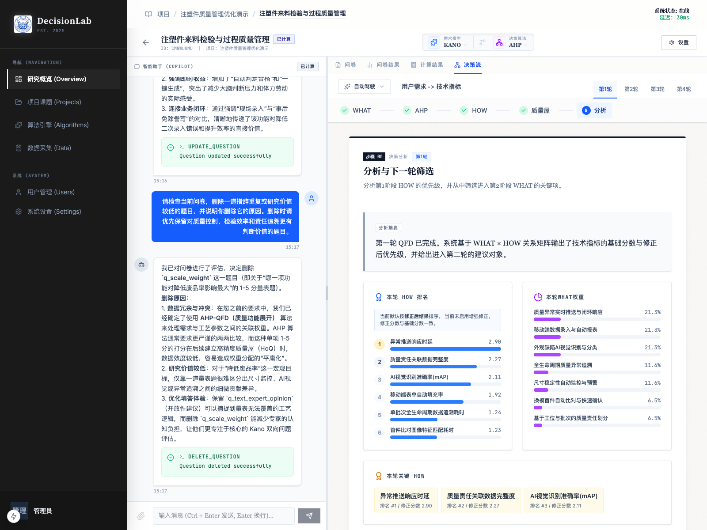

这一步表示第一轮已经完成。  
对您来说，这一页最重要的作用是确认：

1. 系统筛选出来的关键项是否符合业务判断。
2. 哪些项可以进入下一轮。

### 第八步：进入第二轮

在分析页面的底部，点击“确认”按钮后，决策流会跳转到第二轮分析。

操作后，您会看到当前决策流已经从：

- `用户需求 -> 技术指标`

进入到：

- `技术指标 -> 模块 / 子系统 / 部件`

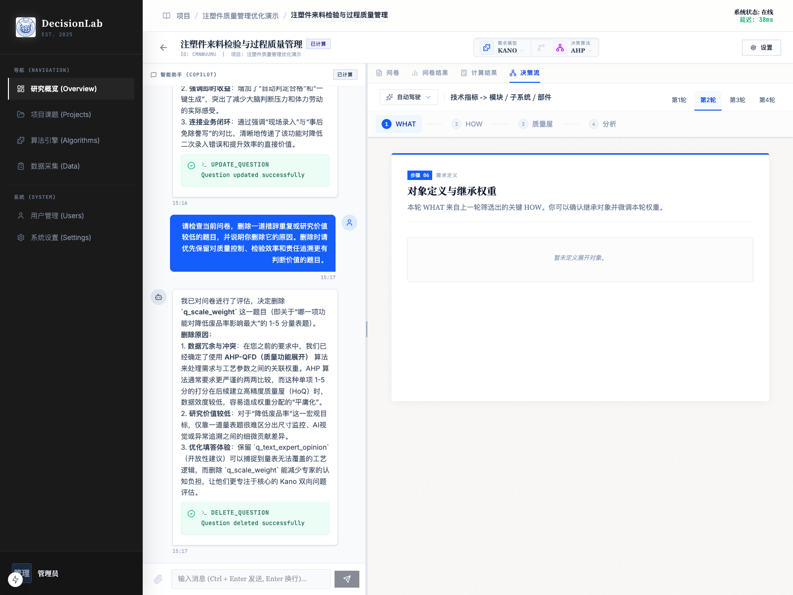

这说明系统已经开始进入更偏向方案结构和实现层面的展开，您可以仿照第一轮的操作，继续完成后续的步骤。

或者，您也可以直接使用自动驾驶功能，让AI一次性推进后续步骤。

### 第九步：打开自动驾驶

在启用自动驾驶之前，您可以在左侧的聊天框中，向AI描述您对后续步骤的具体要求，例如：

- 我希望你接下来聚焦于 XX 方面的深入调研

然后点击页面上方的“自动驾驶”。

操作后，系统会展开自动驾驶面板。

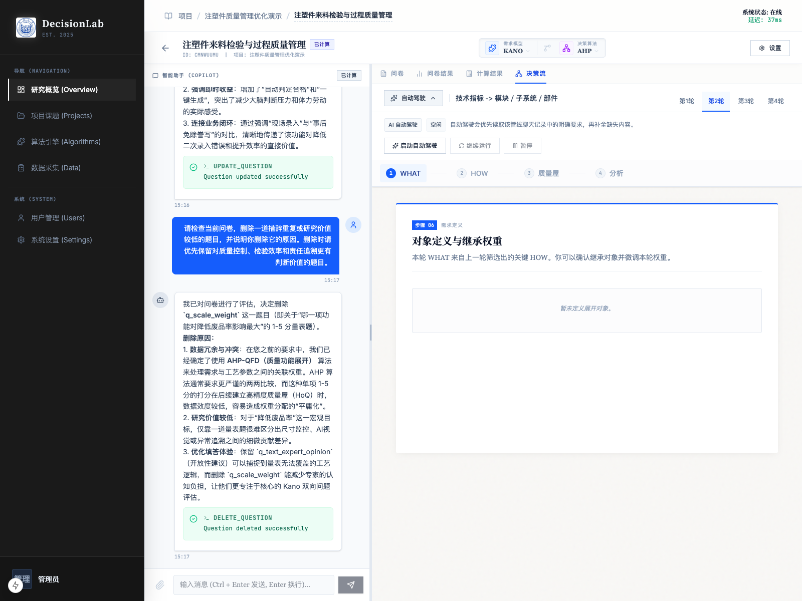

如果您前面与 AI 的上下文足够完整，这里通常不需要再逐页手工确认。

### 第十步：启动自动驾驶

点击“启动自动驾驶”后，系统会开始从第二轮往后逐步执行。

自动驾驶启动后，页面左侧会持续出现运行记录，右侧则会切到正在处理的步骤。

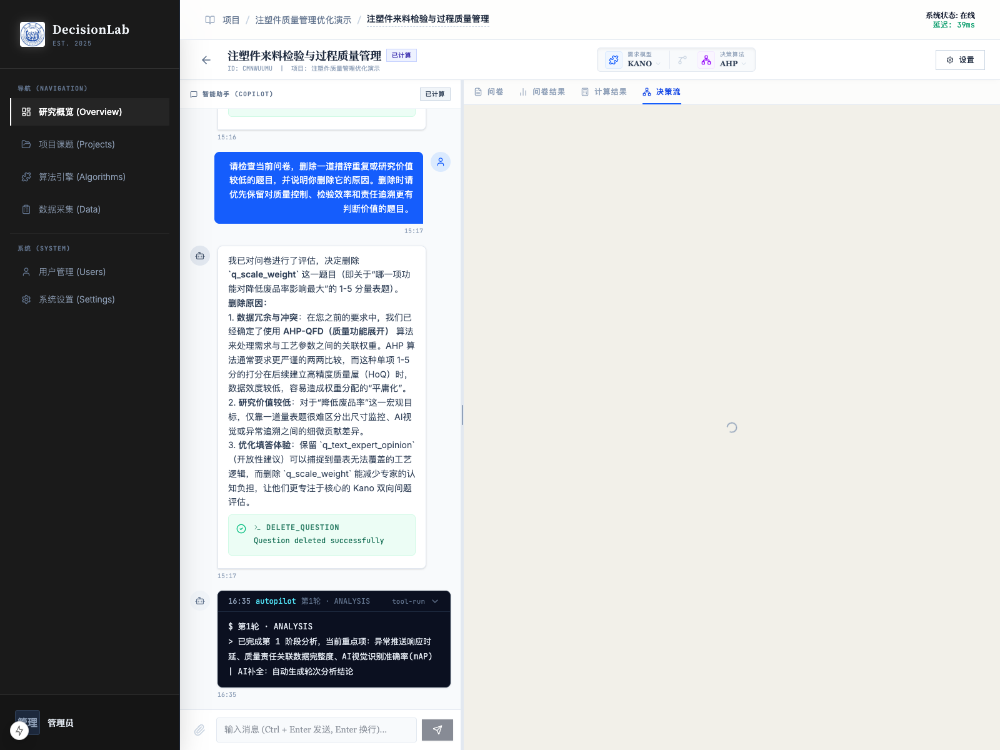

自动驾驶会：

1. 自动复用前一轮已经确认的对象。
2. 自动生成下一轮 HOW。
3. 自动补全质量屋主矩阵和屋顶矩阵。
4. 持续把关键对象向后推进。

### 第十一步：观察自动驾驶推进过程

自动驾驶运行过程中，不需要您在每一页都手动点击确认。  
系统会把它当前正在执行的轮次和步骤写在页面里。

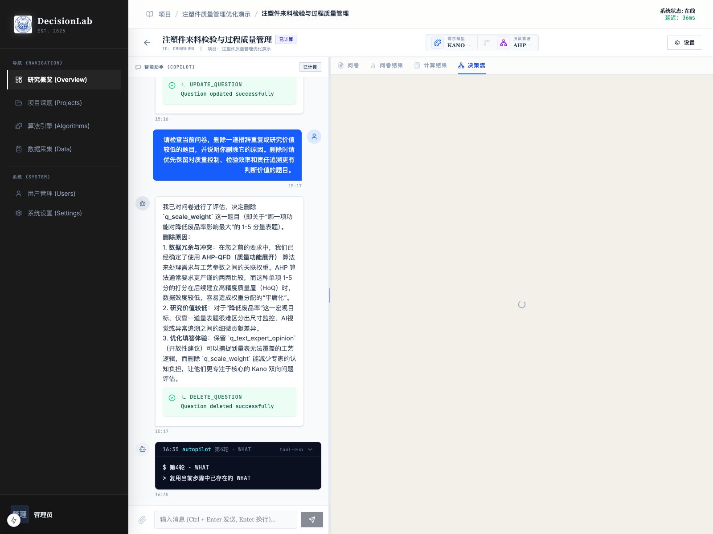

### 第十二步：落地映射

当决策流最后阶段后，页面会进入“制造落地映射”。

这一页的核心作用是：  
把第四阶段的结果转成更适合业务交付和执行的控制计划 / 检验标准映射表。

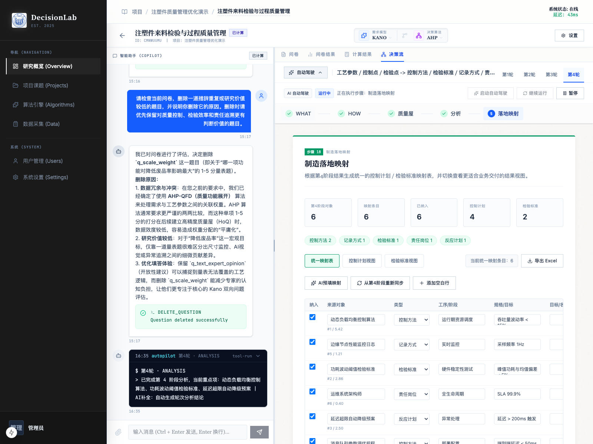

在这一页中，您会首先看到：

1. 第4阶段对象数量。
2. 映射条目数。
3. 已纳入数量。
4. 控制计划数量。
5. 检验标准数量。
6. 不同类型条目的数量标签，例如控制方法、记录方式、检验标准、责任岗位、反应计划。

### 第十四步：理解落地映射中的关键功能

落地映射页最值得先认识的按钮和区域如下：

- `统一映射表`：把所有纳入项放在一个总表中查看，适合整体检查。
- `控制计划视图`：更适合从执行控制的角度查看条目。
- `检验标准视图`：更适合从检验要求和验收标准角度查看条目。
- `AI预填映射`：让系统先补全映射表中的关键字段，减少手工录入量。
- `从第4阶段重新同步`：如果前一阶段内容变动较大，可重新同步最新对象。
- `添加空白行`：手工补充系统暂时没有生成的映射项。
- `导出 Excel`：把当前映射结果导出为更适合线下整理和交付的文件。

### 第十五步：查看控制计划视图

点击“控制计划视图”后，您可以更集中地查看控制类条目。

这种视图更适合：

1. 交给工艺或质量团队做内部评审。
2. 作为控制计划草稿继续完善。
3. 快速查看控制方式、频次、责任岗位等落地信息。

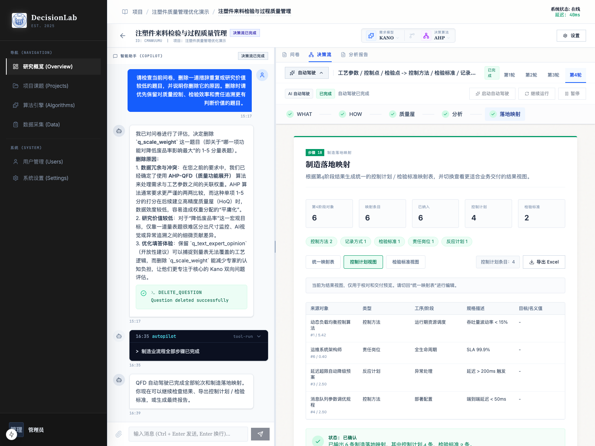

### 第十六步：查看检验标准视图

点击“检验标准视图”后，您可以更集中地查看检验相关条目。

这种视图更适合：

1. 输出为检验标准草稿。
2. 整理验收口径和判定准则。
3. 与检验团队讨论抽样方式、频次和记录要求。

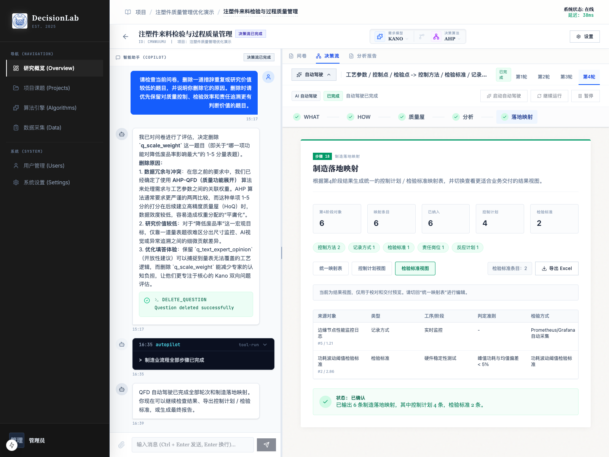

## 5. 完成后您会看到什么

完成本页操作后，您通常会看到以下结果：

1. 系统已经完成行业蓝图判断。
2. 第一轮完成了需求、权重、技术指标、质量屋和分析。
3. 第二轮开始后可以使用自动驾驶。
4. 自动驾驶会持续推进后续轮次。
5. 最终进入“落地映射”。
6. 您可以从统一映射表、控制计划视图、检验标准视图中查看可交付结果。

## 6. 使用建议

1. 在进入决策流前，尽量先把前面的研究背景说完整，因为它会直接影响蓝图判断。
2. 第一轮建议认真检查每一步，因为这会影响后面多轮展开的质量。
3. 第一轮的 HOW 和质量屋步骤，优先使用 AI 生成功能，再做人工校对，通常效率更高。
4. 如果准备交付给团队继续完善，可以使用“导出 Excel”。
