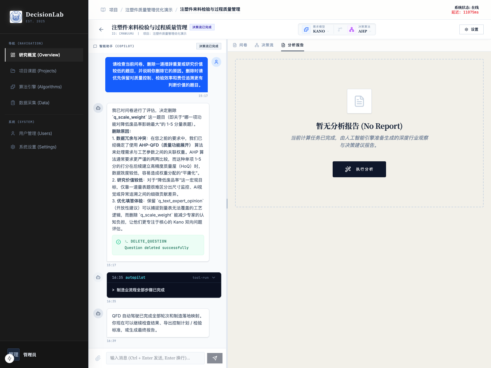
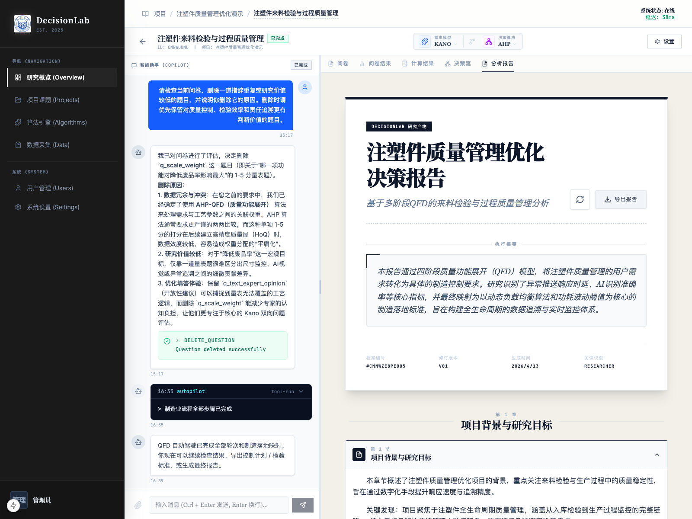
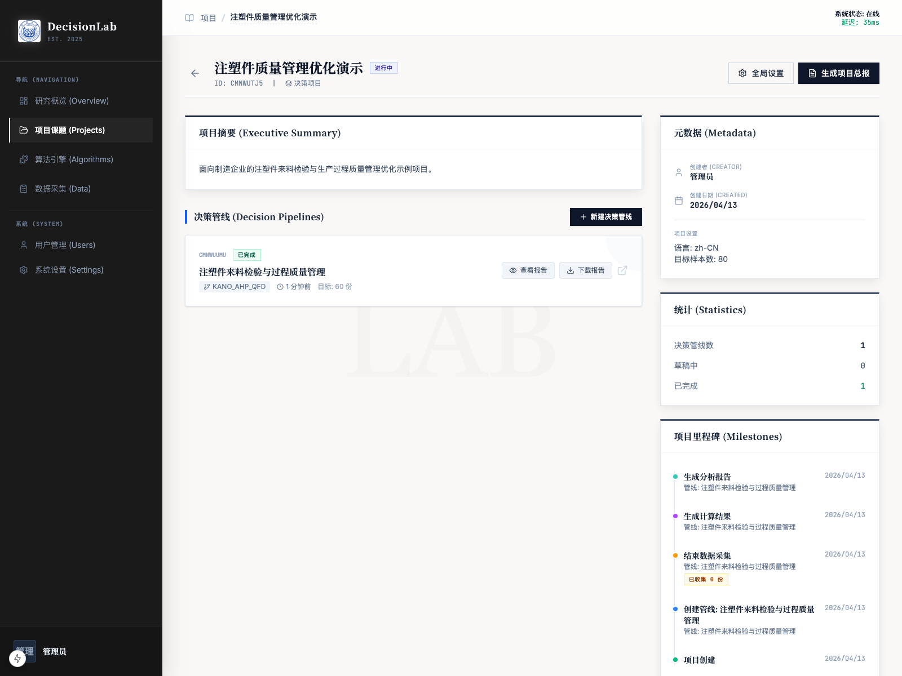

# 分析报告

## 1. 文档用途

本说明用于帮助您在单条决策管线中生成、查看和导出分析报告。  
分析报告是把问卷、计算结果和决策流结果整理成正式研究文档的最后一步，适合用于内部汇报、项目归档和后续决策沟通。

## 2. 您将在本页完成什么

阅读完本页后，您可以完成以下事情：

1. 进入管线中的“分析报告”页。
2. 理解什么时候可以生成分析报告。
3. 在没有报告时执行生成。
4. 在已有报告时查看正式报告页面。
5. 使用“重新生成分析报告”和“导出报告”。
6. 知道在项目页中也可以快速查看和下载该管线报告。

本页继续使用同一条真实管线：

- 项目：`注塑件质量管理优化演示`
- 管线：`注塑件来料检验与过程质量管理`

## 3. 操作前准备

开始前，请先确认：

1. 该管线已经完成问卷采集。
2. 该管线已经生成过计算结果。
3. 如果您希望报告更完整，建议先完成决策流。

在本次示例中，我们已经完成了：

1. 问卷生成与发布。
2. 至少 1 份真实样本填写。
3. 计算结果生成。
4. 决策流与落地映射。

因此当前管线已经具备正式生成分析报告的条件。

## 4. 分步操作

### 第一步：进入“分析报告”

在管线详情页顶部页签区域，点击“分析报告”。

如果系统中还没有这条管线的正式报告，页面会先显示“暂无分析报告”状态，并提供“执行分析”按钮。

这一页的含义很明确：

1. 如果还没生成报告，系统会提醒您当前可以开始执行分析。
2. 如果暂时不能生成，通常意味着前面的核心数据还没准备好。

### 第二步：点击“执行分析”

当页面显示“暂无分析报告”且按钮可点时，点击“执行分析”。

操作后，系统会调用当前管线已经形成的结果，自动生成一份正式报告。  
这份报告通常会综合以下内容：

1. 问卷与需求分析结果。
2. 计算结果。
3. 决策流与多轮 QFD 展开结果。
4. 制造落地映射或服务落地映射结果。

### 第三步：查看生成完成后的报告

报告生成完成后，再次停留在“分析报告”页，您会看到正式报告页面。

在本次示例中，报告已经生成完成，页面上可以看到：

1. 报告封面标题。
2. 副标题。
3. 执行摘要。
4. 档案编号。
5. 版本号。
6. 生成日期。
7. 阅读权限。

这说明当前报告已经不是“草稿入口”，而是正式可阅读、可导出的研究文档。

### 第四步：理解报告页面上的关键按钮

在正式报告页面中，最常用的两个按钮是：

1. `重新生成分析报告`
2. `导出报告`

它们分别适合以下场景：

- `重新生成分析报告`
  当您前面的问卷、决策流或映射内容有变化，希望报告重新汇总最新结果时使用。

- `导出报告`
  当您需要把当前报告以文档形式带走、转发或归档时使用。

建议在前面内容稳定后再重新生成，避免同一条管线短时间反复改动版本。

### 第五步：阅读报告正文

向下浏览报告页面后，您通常会看到按章节整理的正文内容。  
这些内容会把研究背景、关键发现、权重排序、多轮展开和落地建议串成一份完整叙述。

如果您是第一次看，建议优先关注：

1. 执行摘要
2. 项目背景与研究目标
3. 核心需求与技术指标转化
4. 多轮 QFD 结论
5. 最终落地建议

### 第六步：在项目页中快速查看这条管线的报告

除了在管线详情里直接打开报告，您还可以回到项目详情页，在“决策管线”区域直接查看和下载这条管线的分析报告。

本次示例中，项目页已经出现了该管线的：

1. `查看报告`
2. `下载报告`

如果您平时更习惯从项目维度管理多个管线，这个入口会更方便。

## 5. 页面上的关键按钮说明

- `分析报告`：进入当前管线的正式报告页。
- `执行分析`：在没有报告时，生成该管线的第一版分析报告。
- `重新生成分析报告`：基于最新管线结果重建报告。
- `导出报告`：把当前报告导出为文档。
- `查看报告`：在项目页中打开某条管线已经生成的报告。
- `下载报告`：在项目页中直接下载某条管线的报告。

## 6. 完成后您会看到什么

完成本页操作后，您通常会看到以下结果：

1. 管线中已经有了一份正式分析报告。
2. 报告页面会显示封面、执行摘要和章节正文。
3. 您可以在管线内重新生成或导出。
4. 您也可以在项目页中快速查看和下载该管线报告。

这说明该管线已经从“过程分析”进入“成果沉淀”阶段。

## 7. 常见问题

### 什么时候适合生成分析报告？

至少建议在以下内容准备好后再生成：

1. 问卷已经有有效样本。
2. 计算结果已经生成。
3. 如果您要得到更完整的研究结论，最好连决策流也已经完成。

### 报告生成后还能改吗？

可以。  
如果前面的问卷、决策流或落地映射发生变化，您可以使用“重新生成分析报告”。

### 导出报告前需要先保存什么吗？

通常不需要额外保存。  
只要当前页面已经出现正式报告，说明这版内容已经可以导出。

### 为什么项目页里也能看到“查看报告”和“下载报告”？

因为项目页会把每条管线的最终成果集中展示。  
这样您不必逐条打开管线，也能快速找到对应报告。

## 8. 使用建议

1. 建议在问卷、计算结果和决策流都稳定后，再正式生成分析报告。
2. 如果只是中途预览，可先生成一版；真正对外使用前再重新生成一次。
3. 阅读时优先看执行摘要和章节标题，能更快把握全局。
4. 管线较多时，优先在项目页用“查看报告”“下载报告”做统一管理。
5. 若报告将用于正式汇报，建议导出前先快速核对标题、摘要和关键章节是否符合当前业务口径。
