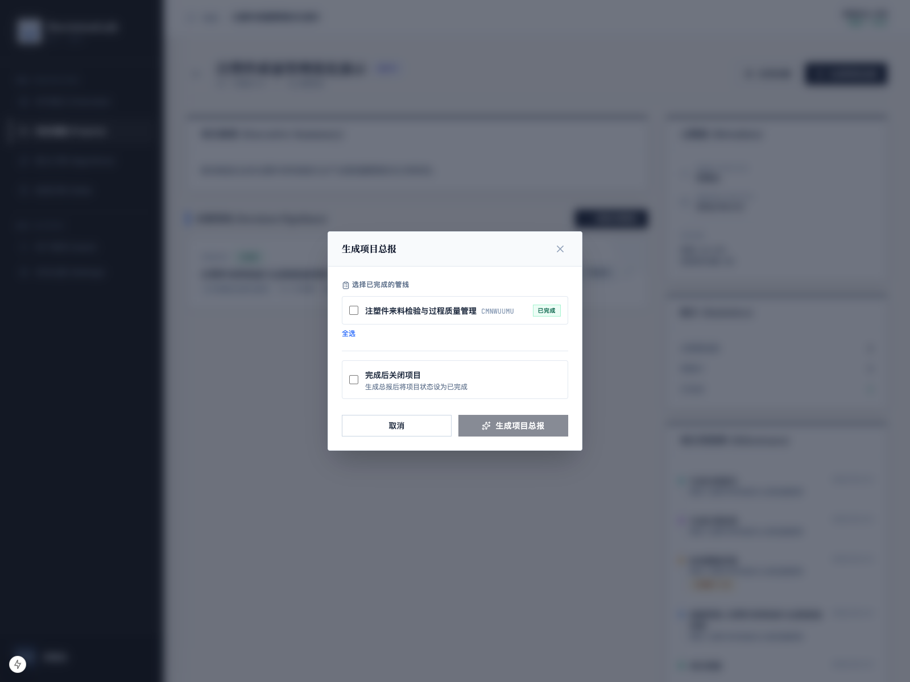
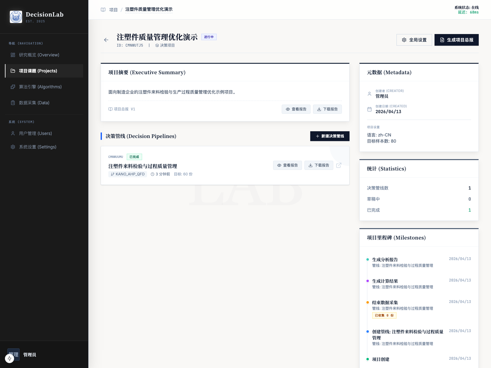
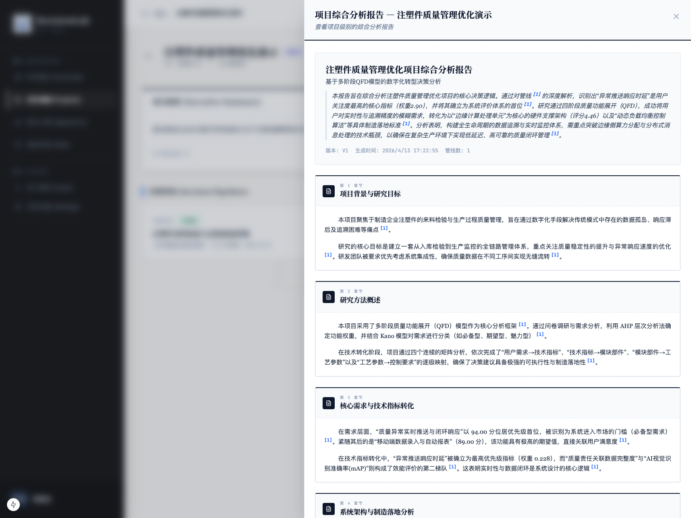

# 生成项目总报

## 1. 文档用途

本说明用于帮助您把一个项目下已经完成的多条管线成果，汇总成一份项目级别的综合总报告。  
如果说单条管线的分析报告更像“单题研究结论”，那么项目总报更像“项目整体总结”。

## 2. 您将在本页完成什么

阅读完本页后，您可以完成以下事情：

1. 理解什么情况下可以生成项目总报。
2. 在项目详情页打开“生成项目总报”。
3. 选择参与汇总的已完成管线。
4. 理解“完成后关闭项目”的含义。
5. 生成项目总报。
6. 查看和下载已经生成的项目总报。

本页使用的项目为：

- 项目：`注塑件质量管理优化演示`

## 3. 操作前准备

开始前，请先确认：

1. 项目下至少有一条已完成的决策管线。
2. 这些管线已经生成过各自的分析报告。

只有当项目里存在“可汇总的管线报告”时，项目总报才有实际意义。  
在本次示例中，项目下已经有一条已完成管线，并且该管线已经生成分析报告，所以可以继续生成项目总报。

## 4. 分步操作

### 第一步：确认项目页中已有可用报告

进入项目详情页后，先查看“决策管线”区域。

如果某条管线已经完成，并且右侧出现了：

1. `查看报告`
2. `下载报告`

说明这条管线已经具备被项目总报汇总的基础。

如果这里还没有报告入口，建议先回到对应管线，把单条分析报告先生成出来。

### 第二步：点击“生成项目总报”

在项目详情页右上方，点击“生成项目总报”。

操作后，系统会弹出配置窗口，让您选择要纳入汇总的已完成管线。

### 第三步：选择已完成的管线

在弹窗中，系统会列出当前项目下所有已完成的管线。  
您可以：

1. 逐条勾选需要纳入总报的管线。
2. 使用“全选”一次性选中。

本次示例中，项目中只有一条已完成管线，因此直接勾选该管线即可。

如果您的项目以后有多条已完成管线，也可以只选其中一部分，生成一版阶段性总报。

弹窗里还有一个可选项：

- `完成后关闭项目`

它的含义是：

1. 如果勾选，系统会在总报生成后，把该项目状态设为已完成。
2. 如果不勾选，项目仍保持当前状态，后续还可以继续新增或补充内容。

如果当前项目还要继续扩展新的管线，建议先不要勾选。  
如果这次总报就是项目正式收尾，则可以根据需要选择。

### 第四步：点击“生成项目总报”

在勾选好要汇总的管线后，点击弹窗右下方的“生成项目总报”。

操作后，系统会自动综合所选管线的分析报告内容，生成一份项目级别的总报告。

### 第五步：查看项目总报生成结果

生成完成后，回到项目详情页，您会看到页面上已经出现项目总报区域，通常会显示：

这说明项目总报已经生成成功，点击项目总报区域中的“查看报告”，系统会打开项目级别的综合分析报告视图：

如果您只想把结果带走，也可以直接使用项目页中的“下载报告”。

## 7. 常见问题

### 为什么有时不能生成项目总报？

最常见的原因是：

1. 项目下还没有已完成的管线。
2. 已完成管线还没有生成各自的分析报告。

### 一个项目可以只选部分管线生成总报吗？

可以。  
如果您只想做阶段性总结，完全可以只选择部分已完成管线。

### “完成后关闭项目”一定要勾选吗？

不一定。  
如果项目后续还可能继续扩展，建议先不要勾选。

### 项目总报和单条管线报告有什么区别？

单条管线报告聚焦某一条研究链路。  
项目总报则站在整个项目层面，把多条管线结果综合起来。
